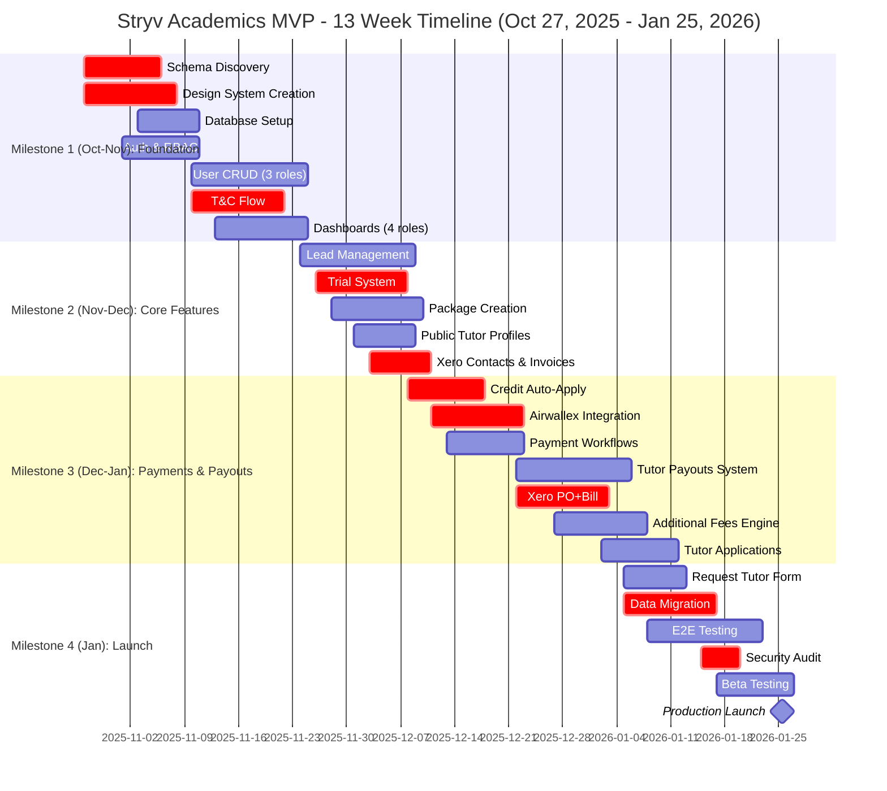

# Stryv Academics MVP - Development Estimation
**13-Week Timeline | October 27, 2025 - January 25, 2026**

---

## 📊 Executive Summary

| Metric | Estimate |
|--------|----------|
| **Total Man-Days** | **480-520 days** |
| **Timeline** | **13 weeks** |
| **Project Start** | **October 27, 2025 (Monday)** |
| **Target Launch** | **Before January 30, 2026** |
| **Team Size** | **8 FTE (9 people)** |
| **Location** | **Vietnam** |
| **Risk Level** | **Medium-High** |

---

## 👥 Accelerated Team Composition

### Core Team - Full-Time (8 FTE)

#### 1. **Tech Lead / Senior Architect** (1 FT)
- **Responsibilities:**
  - Overall architecture design and technical decisions
  - Complex integrations (Xero PO+Bill workflow, Airwallex)
  - Supabase schema discovery and documentation (Weeks 1-2)
  - Code reviews and technical mentoring
  - Critical path blocking issues
- **Estimated Days:** 60 days

#### 2. **Senior Full-Stack Developer** (1 FT) ⭐ *NEW*
- **Responsibilities:**
  - Payment processing workflows (credit auto-apply, additional fees)
  - Tutor payout system (4-stage status flow)
  - Data migration from Airtable
  - Complex business logic implementation
- **Estimated Days:** 60 days

#### 3-6. **Full-Stack Developers** (4 FT) ⭐ *+2 additional*
- **Responsibilities:**
  - **Dev #1:** Lead management, trial system, package creation
  - **Dev #2:** User dashboards (Admin, Tutor, Parent, Student)
  - **Dev #3:** Lesson recording, resource upload, applications workflow
  - **Dev #4:** Tutor profiles, Request Tutor form, email system
- **Estimated Days:** 240 days (60 each)

#### 7. **UI/UX Designer** (1 FT)
- **Responsibilities:**
  - Full design system creation (no brand guidelines provided)
  - Preply-style tutor profile design
  - Mobile-responsive layouts (hamburger menu, touch targets)
  - User flow diagrams for all 4 roles
  - Figma prototypes and component library
  - T&C modal and onboarding screens
- **Estimated Days:** 60 days

#### 8. **QA Engineer Lead** (1 FT)
- **Responsibilities:**
  - Test strategy and planning
  - Automated testing setup (E2E, integration)
  - Manual testing critical flows
  - Bug tracking and regression testing
  - Security testing coordination
  - Beta testing management
- **Estimated Days:** 60 days

---

### Supporting Team - Part-Time (1 FTE)

#### 9. **DevOps Engineer** (0.5 FT)
- **Responsibilities:**
  - Supabase environment setup (dev/staging/prod)
  - CI/CD pipeline configuration
  - Vercel deployment automation
  - Monitoring and logging setup
  - Performance optimization
- **Estimated Days:** 30 days

#### 10. **Project Manager** (0.5 FT)
- **Responsibilities:**
  - Sprint planning and daily standups
  - Stakeholder communication
  - Risk management
  - Timeline tracking
  - Beta testing coordination
- **Estimated Days:** 30 days

---

## 📊 Project Timeline Visualization (Gantt Chart)

**Legend:**
- 🔴 Critical Path Items (marked with red in chart)
- Timeline aligned with development milestones from spec
- Regular tasks support the critical path

**⚠️ HOLIDAY RISK:** Christmas (optional) and Jan 1 (New Year) = reduced capacity weeks

---

## 📅 Detailed 13-Week Timeline Breakdown

### Overview

**Timeline aligned with Development Milestones from MVP Spec:**
- **Milestone 1 (Oct-Nov):** Foundation, Auth, User Management, T&C - Weeks 1-4
- **Milestone 2 (Nov-Dec):** Leads, Trials, Packages, Xero - Weeks 5-6
- **Milestone 3 (Dec-Jan):** Payments, Payouts, Fees, Applications - Weeks 7-10
- **Milestone 4 (Jan):** Testing, Migration, Launch - Weeks 11-13

**Weeks 1-4** are broken down day-by-day for maximum clarity and team coordination.

**Weeks 5-13** are presented in 2-week phases with task-level detail.

### Quick Reference: All 13 Weeks

| Week(s) | Dates | Milestone | Key Deliverables | Man-Days |
|---------|-------|-----------|------------------|----------|
| **Week 1** | Oct 27-Nov 2 | Milestone 1 | Kickoff, schema 50%, design foundations | 40 |
| **Week 2** | Nov 3-9 | Milestone 1 | Schema 100%, database complete, auth working | 40 |
| **Week 3** | Nov 10-16 | Milestone 1 | User CRUD, T&C flow, admin dashboard | 40 |
| **Week 4** | Nov 17-23 | Milestone 1 | All dashboards, mobile responsive ✅ | 40 |
| **Weeks 5-6** | Nov 24-Dec 7 | Milestone 2 | Leads, trials, packages, Xero ✅ | 80 |
| **Weeks 7-8** | Dec 8-21 | Milestone 3 | Payments, Airwallex, credit system | 80 |
| **Weeks 9-10** | Dec 22-Jan 4 | Milestone 3 | Payouts, fees, applications ⚠️ Holidays | 80 |
| **Weeks 11-12** | Jan 5-18 | Milestone 4 | Testing, migration, security audit | 80 |
| **Week 13** | Jan 19-25 | Milestone 4 | Beta testing, launch prep, go-live 🚀 | 40 |
| **TOTAL** | 13 weeks | - | **MVP COMPLETE** | **480** |

---

### **Week 1: Project Kickoff & Schema Discovery**
**Focus:** Infrastructure setup, schema discovery starts, design kickoff
**Milestone 1 Start**
**Man-Days:** 40 days (8 FTE × 5 days)
**Dates:** October 27 - November 2, 2025 (Mon-Sun)

#### Day-by-Day Breakdown

**Monday (Day 1):**
- 🎯 Kickoff meeting (all team, 3hrs)
- Tech Lead + Senior Dev: Start Supabase schema discovery (export database)
- Designer: Design workshop with stakeholders, competitor analysis
- DevOps: Provision Supabase environments (dev/staging/prod)
- PM: Set up project management tools (Jira/Linear), create Slack channels
- Dev #1-4: Environment setup, clone repos, local dev setup

**Tuesday-Wednesday (Days 2-3):**
- Tech Lead + Senior Dev: Schema discovery (identify tables, relationships, constraints)
- Designer: Create design system foundations (colors, typography, spacing)
- DevOps: GitHub Actions setup for CI/CD
- Dev #1: Start Next.js project structure (App Router, TypeScript config)
- Dev #2: Start component library setup (Shadcn/UI, Tailwind)
- Dev #3-4: Research Supabase Auth patterns, RBAC examples
- PM: Xero/Airwallex sandbox account requests

**Thursday-Friday (Days 4-5):**
- Tech Lead: Document core schema findings, identify modification needs
- Senior Dev: Continue schema documentation, create ER diagrams
- Designer: Wireframes for mobile navigation (hamburger menu)
- Dev #1: Authentication scaffold (Supabase Auth integration)
- Dev #2: Base UI components (Button, Input, Card, Table)
- Dev #3: Start RBAC middleware
- Dev #4: Email service setup (Resend config)
- DevOps: Vercel project setup, preview deployments

**Week 1 Deliverables:**
- ✅ 40% schema discovery complete
- ✅ Project infrastructure live (GitHub, Vercel, CI/CD)
- ✅ Design system foundations defined
- ✅ Base component library (10+ components)
- ✅ Next.js project structure ready
- ✅ Team onboarded and productive

---

### **Week 2: Foundation Completion & Database Setup**
**Focus:** Complete schema discovery, database migrations, authentication
**Milestone 1 Continue**
**Man-Days:** 40 days (8 FTE × 5 days)
**Dates:** November 3-9, 2025 (Mon-Sun)

#### Day-by-Day Breakdown

**Monday (Day 6):**
- Tech Lead + Senior Dev: Finalize schema documentation (100%)
- Designer: Review session with stakeholders on design system
- Dev #1: Magic link authentication flow
- Dev #2: Continue component library (Modal, Dropdown, Tabs)
- Dev #3: RBAC implementation (middleware, hooks)
- Dev #4: Email templates structure
- PM: Xero/Airwallex sandbox access confirmation

**Tuesday-Wednesday (Days 7-8):**
- Tech Lead: Start database modifications (4 tables: lessons, relationships, users, tutors)
- Senior Dev: Create 6 new tables (leads, payments, resources, applications, payouts, terms)
- DevOps: Supabase RLS policies implementation
- Designer: Admin dashboard layouts, mobile mockups
- Dev #1: Password reset flow
- Dev #2: Layout components (Sidebar, TopNav, Hamburger Menu)
- Dev #3: Role-based route guards
- Dev #4: T&C modal design implementation

**Thursday (Day 9):**
- Tech Lead + DevOps: RLS policies review and testing
- Senior Dev: Database indexes and constraints
- Designer: Tutor/Parent/Student dashboard wireframes
- Dev #1: Session management
- Dev #2: Form components (multi-step forms)
- Dev #3: User context provider
- Dev #4: PDF generation setup (T&C documents)
- All: Code review session

**Friday (Day 10):**
- Tech Lead: Xero/Airwallex API exploration (sandbox testing)
- Senior Dev: Database migration scripts
- Designer: Design system documentation (Figma)
- Dev #1-4: Sprint review and demo
- PM: Sprint 2 planning, risk assessment
- All: Retrospective

**Week 2 Deliverables:**
- ✅ Schema 100% documented
- ✅ All database modifications complete
- ✅ All 6 new tables created with RLS policies
- ✅ Authentication fully working (magic links, sessions)
- ✅ RBAC middleware complete
- ✅ Design system approved
- ✅ 30+ UI components ready
- ✅ Xero/Airwallex sandbox ready

**🎯 CRITICAL MILESTONE:** Foundation complete, ready for feature development

---

### **Week 3: User Management & Admin Interface**
**Focus:** User CRUD operations, credit/deduction systems, admin dashboard
**Milestone 1 Continue**
**Man-Days:** 40 days (8 FTE × 5 days)
**Dates:** November 10-16, 2025 (Mon-Sun)

#### Day-by-Day Breakdown

**Monday (Day 11):**
- Sprint 2 kickoff
- Dev #2: Start user management list views (Tutors tab)
- Senior Dev: Credit system design (auto-apply logic)
- Dev #1: Start tutor dashboard layout
- Dev #3: T&C onboarding flow (step 1: profile)
- Dev #4: Email template #1 (account invite)
- Designer: Admin widgets design (payout exposure, activity feed)
- Tech Lead: Code reviews, architecture guidance

**Tuesday (Day 12):**
- Dev #2: User detail pages (Tutor CRUD)
- Senior Dev: Deduction system design
- Dev #1: Parent dashboard layout (payment blocking UI)
- Dev #3: T&C step 2 (role-specific setup)
- Dev #4: Resend integration testing
- Designer: Mobile designs for dashboards
- QA Lead: Test plan creation (Week 3-4)

**Wednesday (Day 13):**
- Dev #2: Parent user management, student user management
- Senior Dev: Credit/deduction modals (admin interface)
- Dev #1: Student dashboard (full vs limited access)
- Dev #3: T&C step 3 (scrollable modal, checkbox)
- Dev #4: T&C confirmation email
- Designer: T&C modal refinements
- All: Mid-week sync

**Thursday (Day 14):**
- Dev #2: Admin dashboard (activity feed real-time)
- Senior Dev: Credit/deduction validation rules
- Dev #1: Dashboard widgets (upcoming lessons, quick stats)
- Dev #3: T&C acceptance capture (IP, user agent, timestamp)
- Dev #4: PDF generation for T&C
- QA Lead: Start manual testing (auth flows)
- Designer: Payment blocking banner design

**Friday (Day 15):**
- Dev #2: Tutor Payout Exposure widget
- Senior Dev: Credit/deduction database integration
- Dev #1-3: Bug fixes from QA
- Dev #4: Auto-email T&C PDF after acceptance
- Designer: Sprint 2 design review
- PM: Sprint 3 planning
- All: Demo and retrospective

**Week 3 Deliverables:**
- ✅ User management for all 3 roles (Tutor/Parent/Student)
- ✅ Credit/deduction interfaces complete
- ✅ Admin dashboard with activity feed
- ✅ T&C onboarding flow (all steps)
- ✅ T&C modal UI (mobile-responsive)
- ✅ T&C PDF generation working
- ✅ Dashboard skeletons for all 4 roles

---

### **Week 4: Dashboards & Mobile Navigation**
**Focus:** Complete all dashboards, mobile responsiveness, email system
**Milestone 1 Complete** ✅
**Man-Days:** 40 days (8 FTE × 5 days)
**Dates:** November 17-23, 2025 (Mon-Sun)

#### Day-by-Day Breakdown

**Monday (Day 16):**
- Sprint 3 kickoff
- Dev #1: Tutor dashboard (earnings preview widget)
- Dev #2: Mobile hamburger menu implementation
- Senior Dev: Payment blocking logic (tab disabling)
- Dev #3: Settings pages (all roles)
- Dev #4: Email system architecture (template engine)
- Designer: Earnings tab design (tutor)
- QA: User management testing

**Tuesday (Day 17):**
- Dev #1: Parent dashboard (children's lessons widget)
- Dev #2: Mobile navigation testing (touch targets 48x48px)
- Senior Dev: Unpaid invoice banner (prominent display)
- Dev #3: Account settings pages
- Dev #4: Email templates #2-4 (onboarding emails)
- Designer: Payment interface mockups
- QA: Dashboard navigation testing

**Wednesday (Day 18):**
- Dev #1: Student dashboard (access level variants)
- Dev #2: Responsive table components
- Senior Dev: Credit balance display (Settings → Payment Methods)
- Dev #3: Password change, email preferences
- Dev #4: Email preview system (dev testing)
- Designer: Mobile form designs
- All: Mid-week progress review

**Thursday (Day 19):**
- Dev #1: Dashboard refinements, loading states
- Dev #2: Mobile responsive fixes
- Senior Dev: Deduction balance display (Tutor → Earnings)
- Dev #3: Legal Documents view (Settings)
- Dev #4: Email notification preferences UI
- QA Lead: Mobile testing on real devices
- Designer: Polish pass on all dashboards

**Friday (Day 20):**
- All Devs: Bug fixing sprint
- Senior Dev: Integration testing (credit/deduction flows)
- QA: Comprehensive testing (auth + onboarding + dashboards)
- Designer: Final design review for Phase 1
- PM: Phase 2 planning (Weeks 5-6)
- All: Demo (show full onboarding flow)
- Tech Lead: Week 5 prep (Xero integration readiness)

**Week 4 Deliverables:**
- ✅ All user roles can complete full onboarding
- ✅ All 4 dashboards fully functional
- ✅ Mobile navigation working perfectly
- ✅ Payment blocking logic operational
- ✅ Email system ready (4 templates done)
- ✅ Settings pages complete
- ✅ T&C legally binding (audit trail captured)

**🎯 CRITICAL MILESTONE:** All users can register, onboard, and access dashboards

---

### **Weeks 5-6: Lead Management & Trial System**
**Focus:** Lead lifecycle, trial creation, account detection
**Man-Days:** 100 days

| Task | Days | Owner | Notes |
|------|------|-------|-------|
| **Lead management system** | 15 | Dev #1 | Full CRUD, status flow |
| **Webflow webhook integration** | 6 | Tech Lead | Direct integration |
| **Account auto-detection** | 8 | Tech Lead | Check existing users |
| **Trial lesson creation** | 12 | Tech Lead | Warning-based validation |
| **Trial outcome handling** | 8 | Dev #1 | Success/Failed/Lost |
| **Package creation** | 12 | Senior Dev | Multi-student support |
| **Hours tracking engine** | 8 | Senior Dev | Deduction logic |
| **Overtime detection** | 6 | Senior Dev | Alert on > hours_remaining |
| **Lesson recording (tutor)** | 12 | Dev #3 | Completed/Late cancelled |
| **Lesson report JSONB** | 4 | Dev #3 | Structured data |
| **Public tutor profiles** | 8 | Designer + Dev #4 | Preply-style |
| **Xero Contacts API** | 6 | Tech Lead | On account creation |
| **Xero Invoices API** | 8 | Tech Lead | Trial/Package invoices |

**Milestone:** ✅ Lead → Trial → Package flow complete

---

### **Weeks 7-8: Payment Processing & Credit System**
**Focus:** Xero integration, credit auto-apply, invoicing
**Man-Days:** 105 days

| Task | Days | Owner | Notes |
|------|------|-------|-------|
| **Credit auto-apply logic** | 10 | Senior Dev | Every invoice |
| **Xero invoice with credit line item** | 6 | Tech Lead | Credit transparency |
| **Airwallex integration** | 12 | Tech Lead | Payment links |
| **Bank transfer/FPS flow** | 10 | Dev #4 | Receipt upload |
| **Receipt verification workflow** | 8 | Dev #4 | Admin approve/reject |
| **Payment status sync** | 6 | Tech Lead | Manual Xero polling |
| **Payment blocking logic** | 8 | Dev #2 | Disable tabs if unpaid |
| **Payment Required banner** | 4 | Dev #2 + Designer | Prominent alert |
| **Payments list view (admin)** | 8 | Dev #2 | Filterable table |
| **Parent payment interface** | 10 | Dev #1 | Invoice details, history |
| **Student payment variants** | 6 | Dev #1 | Full/Limited access |
| **Email notifications** | 8 | Dev #4 | 5 payment emails |
| **Testing payment flows** | 9 | QA Lead | End-to-end |

**Milestone:** ✅ Complete payment processing, credit system working

---

### **Weeks 9-10: Tutor Payouts & Additional Fees**
**Focus:** Xero PO+Bill, deductions, additional fees engine
**Man-Days:** 110 days

| Task | Days | Owner | Notes |
|------|------|-------|-------|
| **Tutor payouts table & logic** | 15 | Senior Dev | 4-stage status flow |
| **Xero PO+Bill workflow** | 12 | Tech Lead | Package completion |
| **Deduction auto-apply logic** | 8 | Senior Dev | Every payout |
| **Expected payouts display** | 8 | Dev #3 | Tutor Earnings tab |
| **Additional fees computation** | 12 | Senior Dev | Overtime, late cancel, transport |
| **Additional fees review panel** | 8 | Dev #2 | Admin edit/approve |
| **Late cancellation fee logic** | 4 | Senior Dev | 50% × tutor rate |
| **Manual payout interface** | 6 | Dev #2 | Admin create bills |
| **Payout reconciliation** | 6 | Tech Lead | Xero Bill status check |
| **Lesson resources upload** | 10 | Dev #3 | Supabase Storage |
| **Resource management** | 6 | Dev #3 | View, download, delete |
| **Tutor applications (5 stages)** | 18 | Dev #4 | Full workflow |
| **Application email automation** | 8 | Dev #4 | Stage transitions |

**Milestone:** ✅ Tutor payouts end-to-end, additional fees working

---

### **Weeks 11-12: Integration, Testing & Launch**
**Focus:** Data migration, E2E testing, beta, deployment
**Man-Days:** 105 days

| Task | Days | Owner | Notes |
|------|------|-------|-------|
| **Request Tutor form** | 10 | Dev #4 | Auth/non-auth variants |
| **"Add new child" feature** | 6 | Dev #4 | Inline account creation |
| **Email templates (15 total)** | 15 | Dev #4 | All automated emails |
| **Airtable migration script** | 12 | Tech Lead + Senior Dev | Users, packages, subjects |
| **Migration validation** | 6 | Senior Dev + QA | Zero data loss |
| **Comprehensive E2E testing** | 20 | QA Lead | All critical paths |
| **Security audit** | 5 | Tech Lead + QA Lead | OWASP checklist |
| **Performance optimization** | 8 | DevOps + Tech Lead | <2s page loads |
| **Beta testing coordination** | 10 | PM | 10-20 users |
| **Bug fixing sprint** | 25 | All Devs | Priority triage |
| **Documentation** | 8 | PM + Tech Lead | User guides, API docs |
| **Production deployment** | 5 | DevOps | Go-live |
| **Post-launch monitoring** | 5 | DevOps | 24hr watch |

**Milestone:** ✅ MVP LAUNCHED 🚀

---

## 🎯 Key Success Metrics

### Team Velocity
- **Team Capacity:** 8 FTE × 5 days/week = **40 man-days/week**
- **13 Weeks:** 40 × 13 = **520 man-days available**
- **Required:** 480-520 days
- **Efficiency Factor:** 0.90 (90% productivity)
- **Effective Capacity:** 520 × 0.90 = **468 effective days**

✅ **Reasonable buffer (~8-10%) built in for unforeseen issues**

---

## 🔥 Critical Path & Dependencies

### Week 1-2 Critical Blockers:
1. **Schema discovery MUST complete by end Week 2** (blocks all DB work)
2. **Xero/Airwallex sandbox ready by Week 2** (blocks integration work in Week 5+)
3. **Design system approved by Week 2** (blocks UI implementation)

### Week 3-4 Critical:
4. **T&C flow complete** (blocks user activation)
5. **RBAC working** (blocks all role-specific features)

### Week 5-6 Critical:
6. **Trial system complete** (blocks lead conversion)
7. **Xero Invoices working** (blocks all payments)

### Week 7-8 Critical:
8. **Credit auto-apply** (blocks invoice generation)
9. **Airwallex integration** (blocks go-live)

### Week 9-10 Critical:
10. **Xero PO+Bill** (blocks tutor payouts)

### Week 11-12 Critical:
11. **Data migration** (blocks beta)
12. **Security audit** (blocks production)

---

## ⚠️ Risk Assessment & Mitigation

### High Risks

#### 1. Schema Discovery Delay (2 weeks → 3 weeks)
- **Impact:** Blocks all database work
- **Probability:** Medium (30%)
- **Mitigation:**
  - Start immediately Week 1
  - Tech Lead + Senior Dev full-time
  - Document as you discover
  - Parallel work on non-DB tasks

#### 2. Xero PO+Bill Complexity
- **Impact:** +10-15 days
- **Probability:** Medium-High (40%)
- **Mitigation:**
  - Early POC in Week 2 (sandbox testing)
  - Tech Lead dedicated to this
  - Xero support contract if available

#### 3. Design System Delays (No Brand Guidelines)
- **Impact:** +5-10 days
- **Probability:** Medium (35%)
- **Mitigation:**
  - Designer starts Day 1
  - Use Shadcn/UI for base components
  - Weekly design reviews
  - Focus on mobile-first

#### 4. Airtable Data Quality Issues
- **Impact:** +10-15 days
- **Probability:** High (50%)
- **Mitigation:**
  - Early data audit (Week 8)
  - Migration script with validation
  - Manual cleanup if needed
  - Staggered migration (test with 10% first)

#### 5. Team Coordination Overhead
- **Impact:** 15-20% efficiency loss
- **Probability:** High (60%)
- **Mitigation:**
  - Daily standups (max 15min)
  - Clear ownership assignments
  - Pair programming for critical features
  - Slack channels per feature area

### Medium Risks

#### 6. Airwallex API Documentation Gaps
- **Impact:** +5 days
- **Probability:** Medium (35%)
- **Mitigation:**
  - Tech support contact
  - Early sandbox testing

#### 7. Mobile Responsiveness Issues
- **Impact:** +5-8 days
- **Probability:** Medium (30%)
- **Mitigation:**
  - Mobile-first design
  - Test on real devices weekly

#### 8. Trial Validation UX Complexity
- **Impact:** +3-5 days
- **Probability:** Low-Medium (25%)
- **Mitigation:**
  - Clear warning messages
  - Admin override easy to access

---

## 📊 Resource Allocation

### Team Velocity Calculation
- **Team Capacity:** 8 FTE × 5 days/week = **40 man-days/week**
- **13 Weeks:** 40 × 13 = **520 man-days available**
- **Required:** 480-520 days
- **Efficiency Factor:** 0.90 (account for coordination overhead)
- **Effective Capacity:** 520 × 0.90 = **468 effective days**

✅ **Note:** Reasonable buffer (~8-10%) built in for unforeseen issues.

### Parallel Work Streams

#### Stream 1: Foundation (Weeks 1-2)
- Tech Lead, Senior Dev, Designer, DevOps

#### Stream 2: User Management (Weeks 3-4)
- All 4 Full-Stack Devs, Designer

#### Stream 3: Core Features (Weeks 5-6)
- Tech Lead + Dev #1 (Leads/Trials)
- Senior Dev (Packages)
- Dev #2 (Dashboards)
- Dev #3 (Lessons)
- Dev #4 (Profiles)

#### Stream 4: Payments (Weeks 7-8)
- Tech Lead + Senior Dev (Xero/Airwallex)
- Dev #1, #2 (UI integrations)
- Dev #4 (Emails)

#### Stream 5: Payouts (Weeks 9-10)
- Tech Lead + Senior Dev (Xero PO+Bill)
- Dev #2, #3, #4 (Features)

#### Stream 6: Launch (Weeks 11-12)
- All hands on testing and bugs

---

## 💰 Cost Estimation (13-Week Timeline)

### Rate Assumptions (USD Daily Rates - Vietnam):

- Tech Lead: $100/day
- Senior Full-Stack: $90/day
- Full-Stack Developer: $70/day
- UI/UX Designer: $75/day
- QA Engineer Lead: $65/day
- DevOps: $80/day
- PM: $70/day

### Breakdown:

| Role | FTE | Days | Rate/Day | Subtotal |
|------|-----|------|----------|----------|
| Tech Lead | 1.0 | 60 | $100 | $6,000 |
| Senior Full-Stack | 1.0 | 60 | $90 | $5,400 |
| Full-Stack Dev #1 | 1.0 | 60 | $70 | $4,200 |
| Full-Stack Dev #2 | 1.0 | 60 | $70 | $4,200 |
| Full-Stack Dev #3 | 1.0 | 60 | $70 | $4,200 |
| Full-Stack Dev #4 | 1.0 | 60 | $70 | $4,200 |
| UI/UX Designer | 1.0 | 60 | $75 | $4,500 |
| QA Engineer Lead | 1.0 | 60 | $65 | $3,900 |
| DevOps | 0.5 | 30 | $80 | $2,400 |
| PM | 0.5 | 30 | $70 | $2,100 |
| **TOTAL** | **8** | **480** | - | **$41,100** |

### Cost Range with Rate Variations:
- **Conservative (Budget Tier):** $37,000 - $41,000
- **Mid-Range (Standard Tier):** $41,000 - $46,000
- **Premium (Senior Tier):** $46,000 - $52,000

**Recommended Budget:** **$43,000 - $48,000 USD**

---

## ✅ Success Criteria

### Technical Deliverables:
- [ ] Database schema documented and migrated
- [ ] All 6 new tables created with indexes
- [ ] Authentication working (magic links, RBAC)
- [ ] T&C acceptance for all roles
- [ ] Lead → Trial → Package flow end-to-end
- [ ] Xero integration (Contacts, Invoices, PO+Bills)
- [ ] Airwallex payment links functional
- [ ] Credit auto-applies to all invoices
- [ ] Deduction auto-applies to all payouts
- [ ] Tutor applications (5-stage workflow)
- [ ] Email system (15 automated templates)
- [ ] Data migration complete (zero loss)
- [ ] Public tutor profiles accessible
- [ ] Mobile-responsive (hamburger menu, touch targets)

### Performance Targets:
- [ ] Page load <2s (authenticated)
- [ ] Public profiles <1s
- [ ] 10MB file uploads work
- [ ] 70%+ automated test coverage
- [ ] Zero critical security issues

### Business Validation:
- [ ] 10-20 beta users successfully onboard
- [ ] Trial creation works end-to-end
- [ ] Payment blocking logic correct
- [ ] Tutor payouts calculated accurately
- [ ] Additional fees trigger on package completion

---

## 🎯 Launch Readiness Checklist (Week 12)

### Pre-Launch (Days 1-3):
- [ ] All production environments provisioned
- [ ] SSL certificates installed
- [ ] Domain DNS configured
- [ ] Backup strategy tested
- [ ] Monitoring dashboards live
- [ ] Error tracking configured (Sentry)
- [ ] Support email inbox ready

### Launch Day (Day 4):
- [ ] Data migration executed
- [ ] Migration validation passed
- [ ] Production deployment successful
- [ ] Smoke tests passed
- [ ] Beta users invited
- [ ] Launch announcement sent

### Post-Launch (Days 5-7):
- [ ] 24hr on-call rotation active
- [ ] Bug triage process running
- [ ] User feedback collection
- [ ] Performance monitoring
- [ ] Daily standup for hot fixes

---

## 📋 Open Questions for Client

Before kicking off, please confirm:

1. **Is the 2-week schema discovery timeline realistic?**
   - Can we get database export/access Day 1?
   - Are there any Supabase access restrictions?

2. **What design references do you have?**
   - Any competitor platforms you like?
   - Specific color palette preferences?

3. **Xero/Airwallex account access:**
   - Who owns these accounts?
   - Can we get API credentials by Week 2?

4. **Airtable data:**
   - Can we audit data quality in advance (Week 8)?
   - Any known data issues?
   - How many records per table?

5. **Beta testing:**
   - Do you have 10-20 users identified?
   - Will they be available Week 11-12?

6. **Payment rates:**
   - Typical trial fee amount?
   - Average package size (hours/price)?

7. **Go-live criteria:**
   - Must all features be 100% or phased launch OK?
   - Acceptable bug severity for launch?

---

## 🚀 Next Steps

### Immediate Actions (Before Project Start):

1. **Contracts & SOW** (Week -2)
   - Finalize team composition
   - Sign agreements
   - Set up payment milestones

2. **Access Provisioning** (Week -1)
   - Supabase database access
   - Xero sandbox account
   - Airwallex sandbox account
   - GitHub repository
   - Slack workspace
   - Figma workspace

3. **Kickoff Meeting** (Day 1)
   - Team introductions
   - Schema discovery planning
   - Design workshop
   - Sprint 1 planning

4. **Weekly Cadence:**
   - Monday: Sprint planning
   - Daily: 15min standup
   - Wednesday: Design review
   - Friday: Demo + retrospective

---

## 📞 Contact & Sign-off

**Prepared For:**
- Zach (Project Lead)
- zach@stryvacademics.com
- Levitate Limited (Stryv Academics)

**Estimation Date:** December 2024

**Valid Until:** January 31, 2025

---

## 📋 Key Assumptions

1. **Schema discovery completes in 2 weeks** (Weeks 1-2)
2. **Xero/Airwallex sandbox ready by Week 2**
3. **No brand guidelines** (full design system creation)
4. **13-week timeline** with target completion before January 30, 2026
5. **Team starts simultaneously Week 1** (October 27, 2025)
6. **No major scope changes** during development
7. **Holiday weeks** (Dec 25-Jan 1) = reduced capacity but accounted for

---

## ⚠️ Important Notes

1. **This is an aggressive timeline.** The 12-week delivery requires:
   - Immediate team availability (all 8.5 FTE)
   - Fast decision-making (max 24hr turnaround)
   - Limited scope changes
   - Strong client partnership

2. **Schema discovery is critical.** If this extends beyond 2 weeks, the entire timeline shifts.

3. **Efficiency assumptions:** We've assumed 85% efficiency due to coordination overhead with a larger team. This is realistic but means there's minimal slack.

4. **Quality vs. Speed tradeoff:** With this accelerated timeline, we're optimizing for feature completeness and stability, but some polish items may be deferred to post-launch.

5. **Recommended contingency:** Consider a 2-week buffer for unforeseen issues (total 14 weeks).

---

## End of Estimation Document
