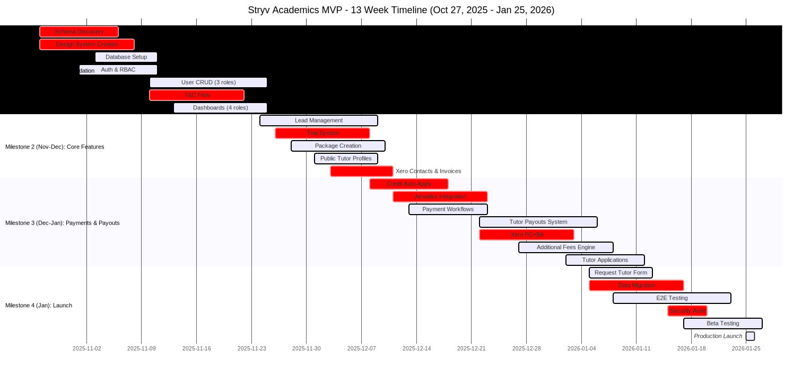

# Stryv Academics MVP - Estimation Summary
**13-Week Timeline | October 27, 2025 - January 25, 2026**

---

## 📊 Executive Summary

### Option A: Standard Development

| Metric | Estimate |
|--------|----------|
| **Total Man-Days** | **480-520 days** |
| **Timeline** | **13 weeks** |
| **Project Start** | **October 27, 2025 (Monday)** |
| **Target Launch** | **Before January 30, 2026** |
| **Team Size** | **8 FTE (9 people)** |
| **Location** | **Vietnam** |
| **Budget** | **$43,000 - $48,000 USD** |

### Option B: AI-Assisted Development

| Metric | Estimate |
|--------|----------|
| **Total Man-Days** | **510-550 days** |
| **Timeline** | **~10 weeks** ⚡ |
| **Project Start** | **October 27, 2025 (Monday)** |
| **Target Launch** | **Early January 2026** |
| **Team Size** | **8.5 FTE (10 people)** |
| **Location** | **Vietnam** |
| **Budget** | **$50,000 - $55,000 USD** |

**Key Differences:**
- +15% rates for enhanced AI-assisted development capabilities and cost of AI tools (e.g. Claude Code, Cursor, ChatGPT)
- Dedicated Business Analyst to create AI-friendly structured documentation
- **Faster delivery: ~10 weeks vs 13 weeks** due to improved development velocity with AI tools and better documentation

---

## 👥 Team Composition

### Core Team - Full-Time (8 FTE)

#### 1. **Tech Lead / Senior Architect** (1 FT)
- **Responsibilities:**
  - Overall architecture design and technical decisions
  - Complex integrations (Xero PO+Bill workflow, Airwallex)
  - Supabase schema discovery and documentation (Weeks 1-2)
  - Code reviews and technical mentoring
  - Critical path blocking issues
- **Estimated Days:** 60 days

#### 2. **Senior Full-Stack Developer** (1 FT)
- **Responsibilities:**
  - Payment processing workflows (credit auto-apply, additional fees)
  - Tutor payout system (4-stage status flow)
  - Data migration from Airtable
  - Complex business logic implementation
- **Estimated Days:** 60 days

#### 3-6. **Full-Stack Developers** (4 FT)
- **Responsibilities:**
  - **Dev #1:** Lead management, trial system, package creation
  - **Dev #2:** User dashboards (Admin, Tutor, Parent, Student)
  - **Dev #3:** Lesson recording, resource upload, applications workflow
  - **Dev #4:** Tutor profiles, Request Tutor form, email system
- **Estimated Days:** 240 days (60 each)

#### 7. **UI/UX Designer** (1 FT)
- **Responsibilities:**
  - Full design system creation (no brand guidelines provided)
  - Preply-style tutor profile design
  - Mobile-responsive layouts (hamburger menu, touch targets)
  - User flow diagrams for all 4 roles
  - Figma prototypes and component library
  - T&C modal and onboarding screens
- **Estimated Days:** 60 days

#### 8. **QA Engineer Lead** (1 FT)
- **Responsibilities:**
  - Test strategy and planning
  - Automated testing setup (E2E, integration)
  - Manual testing critical flows
  - Bug tracking and regression testing
  - Security testing coordination
  - Beta testing management
- **Estimated Days:** 60 days

---

### Supporting Team - Part-Time

**Option A:** 1 FTE (2 people) | **Option B:** 1.5 FTE (3 people)

#### 9. **DevOps Engineer** (0.5 FT)
- **Responsibilities:**
  - Supabase environment setup (dev/staging/prod)
  - CI/CD pipeline configuration
  - Vercel deployment automation
  - Monitoring and logging setup
  - Performance optimization
- **Estimated Days:** 30 days

#### 10. **Project Manager** (0.5 FT)
- **Responsibilities:**
  - Sprint planning and daily standups
  - Stakeholder communication
  - Risk management
  - Timeline tracking
  - Beta testing coordination
- **Estimated Days:** 30 days

#### 11. **Business Analyst** (0.5 FT) - *Option B Only*
- **Responsibilities:**
  - Analyze and break down business requirements
  - Create AI-friendly structured documentation
  - Maintain requirement traceability matrix
  - Generate detailed user stories with acceptance criteria
  - Create technical specification templates for AI-assisted development
  - Bridge communication between stakeholders and development team
- **Estimated Days:** 30 days

---

## 💰 Cost Estimation

### Option A: Standard Development

#### Rate Assumptions (USD Daily Rates - Vietnam)

- Tech Lead: $100/day
- Senior Full-Stack: $90/day
- Full-Stack Developer: $70/day
- UI/UX Designer: $75/day
- QA Engineer Lead: $65/day
- DevOps: $80/day
- PM: $70/day

#### Breakdown

| Role | FTE | Days | Rate/Day | Subtotal |
|------|-----|------|----------|----------|
| Tech Lead | 1.0 | 60 | $100 | $6,000 |
| Senior Full-Stack | 1.0 | 60 | $90 | $5,400 |
| Full-Stack Dev #1 | 1.0 | 60 | $70 | $4,200 |
| Full-Stack Dev #2 | 1.0 | 60 | $70 | $4,200 |
| Full-Stack Dev #3 | 1.0 | 60 | $70 | $4,200 |
| Full-Stack Dev #4 | 1.0 | 60 | $70 | $4,200 |
| UI/UX Designer | 1.0 | 60 | $75 | $4,500 |
| QA Engineer Lead | 1.0 | 60 | $65 | $3,900 |
| DevOps | 0.5 | 30 | $80 | $2,400 |
| PM | 0.5 | 30 | $70 | $2,100 |
| **TOTAL** | **8 FTE** | **480** | - | **$41,100** |

**Recommended Budget:** **$43,000 - $48,000 USD**

---

### Option B: AI-Assisted Development

#### Rate Assumptions (USD Daily Rates - Vietnam)

*All rates increased by 15% for enhanced AI-assisted development capabilities*

- Tech Lead: $115/day (+15%)
- Senior Full-Stack: $104/day (+15%)
- Full-Stack Developer: $81/day (+15%)
- UI/UX Designer: $86/day (+15%)
- QA Engineer Lead: $75/day (+15%)
- DevOps: $92/day (+15%)
- PM: $81/day (+15%)
- Business Analyst: $81/day (new role)

#### Breakdown

| Role | FTE | Days | Rate/Day | Subtotal |
|------|-----|------|----------|----------|
| Tech Lead | 1.0 | 60 | $115 | $6,900 |
| Senior Full-Stack | 1.0 | 60 | $104 | $6,240 |
| Full-Stack Dev #1 | 1.0 | 60 | $81 | $4,860 |
| Full-Stack Dev #2 | 1.0 | 60 | $81 | $4,860 |
| Full-Stack Dev #3 | 1.0 | 60 | $81 | $4,860 |
| Full-Stack Dev #4 | 1.0 | 60 | $81 | $4,860 |
| UI/UX Designer | 1.0 | 60 | $86 | $5,160 |
| QA Engineer Lead | 1.0 | 60 | $75 | $4,500 |
| DevOps | 0.5 | 30 | $92 | $2,760 |
| PM | 0.5 | 30 | $81 | $2,430 |
| Business Analyst | 0.5 | 30 | $81 | $2,430 |
| **TOTAL** | **8.5 FTE** | **510** | - | **$49,860** |

**Recommended Budget:** **$50,000 - $55,000 USD**

#### Benefits of Option B
- **Faster Time-to-Market:** ~10 weeks vs 13 weeks (~3 weeks faster delivery) ⚡
- **AI-Friendly Documentation:** Structured requirements enable better AI-assisted code generation
- **Improved Velocity:** Clear specifications reduce development back-and-forth by ~15-20%
- **Better Quality:** Enhanced documentation leads to fewer bugs and misunderstandings
- **Knowledge Transfer:** Well-documented requirements facilitate onboarding and maintenance
- **ROI:** Additional $8,760 investment yields improved code quality, reduced rework, and ~3 weeks faster delivery

---

## 📅 Timeline Overview

**Note:**
- **Option A (Standard):** 13 weeks - No AI tools or Business Analyst role. 
  - As outlined in below milestones and Gantt chart. 
  - Can use as baseline for Option B.
- **Option B (AI-Assisted):** ~10 weeks - Accelerated timeline due to:
  - Enhanced development velocity with AI-assisted coding tools
  - Reduced clarification cycles with structured documentation
  - Faster implementation of business logic with clear specifications
  - Better parallel work coordination

### Development Milestones (Option A)

| Milestone | Weeks | Dates | Key Deliverables |
|-----------|-------|-------|------------------|
| **Milestone 1** | Weeks 1-4 | Oct 27 - Nov 23 | Foundation, Auth, User Management, T&C ✅ |
| **Milestone 2** | Weeks 5-6 | Nov 24 - Dec 7 | Leads, Trials, Packages, Xero ✅ |
| **Milestone 3** | Weeks 7-10 | Dec 8 - Jan 4 | Payments, Payouts, Fees, Applications ✅ |
| **Milestone 4** | Weeks 11-13 | Jan 5 - Jan 25 | Testing, Migration, Launch 🚀 |

### Quick Reference: All 13 Weeks (Option A)

| Week(s) | Dates | Milestone | Key Deliverables | Man-Days |
|---------|-------|-----------|------------------|----------|
| **Week 1** | Oct 27-Nov 2 | Milestone 1 | Kickoff, schema 50%, design foundations | 40 |
| **Week 2** | Nov 3-9 | Milestone 1 | Schema 100%, database complete, auth working | 40 |
| **Week 3** | Nov 10-16 | Milestone 1 | User CRUD, T&C flow, admin dashboard | 40 |
| **Week 4** | Nov 17-23 | Milestone 1 | All dashboards, mobile responsive ✅ | 40 |
| **Weeks 5-6** | Nov 24-Dec 7 | Milestone 2 | Leads, trials, packages, Xero ✅ | 80 |
| **Weeks 7-8** | Dec 8-21 | Milestone 3 | Payments, Airwallex, credit system | 80 |
| **Weeks 9-10** | Dec 22-Jan 4 | Milestone 3 | Payouts, fees, applications ⚠️ Holidays | 80 |
| **Weeks 11-12** | Jan 5-18 | Milestone 4 | Testing, migration, security audit | 80 |
| **Week 13** | Jan 19-25 | Milestone 4 | Beta testing, launch prep, go-live 🚀 | 40 |
| **TOTAL** | 13 weeks | - | **MVP COMPLETE** | **480** |

### Key Dates

| Date | Milestone |
|------|-----------|
| **Oct 27, 2025** | Project Kickoff (Monday) |
| **Nov 23, 2025** | Milestone 1 Complete (Foundation) |
| **Dec 7, 2025** | Milestone 2 Complete (Core Features) |
| **Jan 4, 2026** | Milestone 3 Complete (Payments & Payouts) |
| **Jan 25, 2026** | Milestone 4 Complete - Launch 🚀 |

---

## 📊 Gantt Chart

**Legend:**
- 🔴 Critical Path Items (marked with red in chart)
- Regular tasks support the critical path
- This Gantt chart is only for Option A (Standard)

---

## 📊 Options Comparison

| Aspect | Option A: Standard | Option B: AI-Assisted |
|--------|-------------------|----------------------|
| **Team Size** | 8 FTE (9 people) | 8.5 FTE (10 people) |
| **Man-Days** | 480 days | 510 days |
| **Budget** | $41,100 ($43K-$48K range) | $49,860 ($50K-$55K range) |
| **Timeline** | 13 weeks | **~10 weeks** ⚡ |
| **Daily Rates** | Standard Vietnam rates | +15% premium rates |
| **Business Analyst** | ❌ Not included | ✅ 0.5 FT dedicated |
| **Documentation** | Standard | AI-friendly structured |
| **Development Velocity** | Standard | +15-20% with AI tools |
| **Best For** | Budget-conscious projects | Quality + speed with AI tools |
| **Additional Cost** | Baseline | +$8,760 (+21.3%) |
| **Time Savings** | Baseline | **~3 weeks faster** ⚡ |

---

## 📋 Key Assumptions

1. **Schema discovery completes in 2 weeks** (Weeks 1-2)
2. **Xero/Airwallex sandbox ready by Week 2**
3. **No brand guidelines** (full design system creation)
4. **13-week timeline** with target completion before January 30, 2026
5. **Team starts simultaneously Week 1** (October 27, 2025)
6. **No major scope changes** during development
7. **Holiday weeks** (Dec 22-Jan 4) = reduced capacity but accounted for (1-2 days off per dev)

---

## End of Summary
