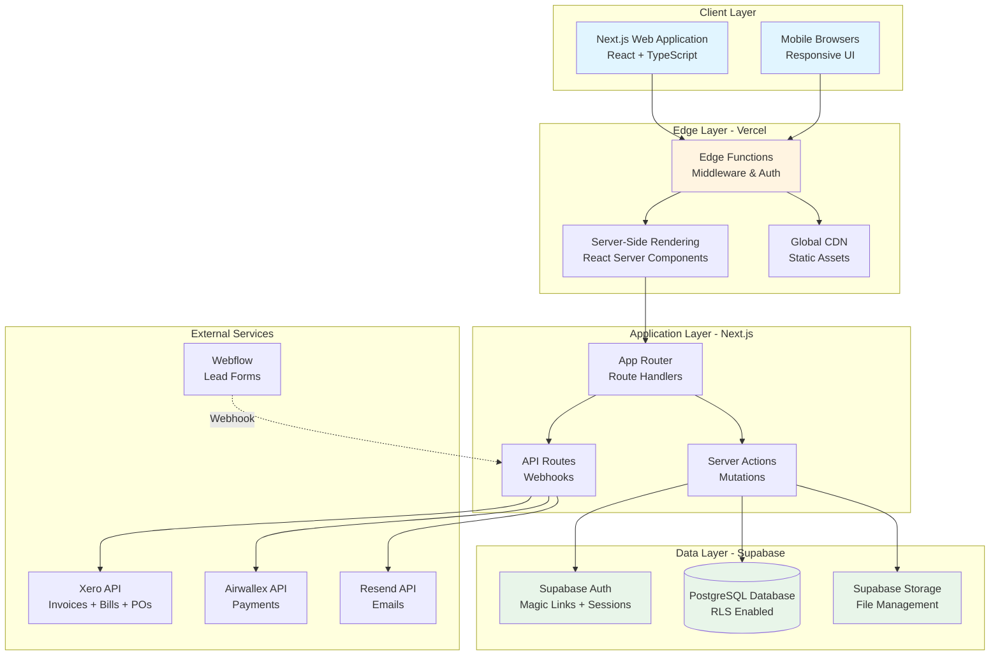
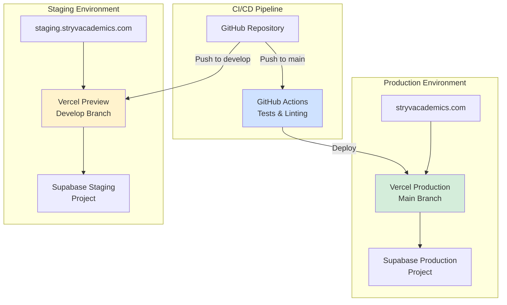

# Design Document

## Overview

### Description

Stryv Academics MVP is a unified web application platform designed to replace a fragmented tool stack (WhatsApp, Airtable, Google Calendar, Airwallex, Xero, and Zoom) for Hong Kong's largest peer-to-peer tutoring platform serving 400+ tutors and 500+ families. The platform centralizes operations for four user roles (Admin, Tutor, Parent, Student) and streamlines the complete tutoring lifecycle from lead acquisition through lesson delivery and financial settlement.

The application provides role-based dashboards, lead management workflows, trial lesson systems, package creation and tracking, payment processing with automatic credit/deduction application, tutor payout management, and a 5-stage tutor application workflow.

### Techstack

**Frontend:**
- **Next.js 15** (App Router) - React framework for building full-stack web applications with server-side rendering, static site generation, and API routes
- **TypeScript** - Type-safe development with enhanced developer experience
- **React 19** - UI component library with server components support
- **Tailwind CSS** - Utility-first CSS framework for rapid UI development
- **shadcn/ui** - High-quality React components built on Radix UI for consistent design system

**Backend & Infrastructure:**
- **Supabase** - Open-source Backend-as-a-Service providing:
  - PostgreSQL database with PostGIS for structured data storage
  - Built-in authentication with magic link support
  - Row Level Security (RLS) for fine-grained access control
  - Supabase Storage for file uploads (lesson resources, receipts, profile photos)
  - Real-time subscriptions (future enhancement for activity feeds)

**External Integrations:**
- **Xero API (Native)** - Financial management for invoices, purchase orders, and bills
- **Airwallex API** - Payment gateway for card payments and international transfers
- **Webflow Webhooks** - Direct lead capture from marketing website forms
- **Resend API** - Transactional email service with React Email templates

**DevOps & Deployment:**
- **Vercel** - Deployment platform optimized for Next.js with edge functions
- **GitHub Actions** - CI/CD pipeline for automated testing and deployment

**Why This Stack:**

1. **Next.js + Supabase**: Optimal for rapid MVP development with built-in authentication, database, and storage. App Router provides better performance with server components and reduces client-side JavaScript.

2. **TypeScript**: Essential for large-scale application with complex business logic (credit/deduction systems, multi-role access control, financial calculations).

3. **Supabase RLS**: Database-level security ensures data isolation across tenants and roles, eliminating the risk of permission bypasses in application code.

4. **Native API Integrations**: Direct integration with Xero, Airwallex, and Resend eliminates dependency on middleware platforms (like Make.com) reducing costs and points of failure.

5. **Vercel Edge**: Provides global CDN, automatic SSL, and preview deployments for each PR, accelerating development cycles.

## High Level Architecture Design

### System Architecture

The Stryv MVP follows a modern three-tier architecture with edge-optimized delivery:



### System Modules

The application is organized into the following core modules:

1. **Authentication & Authorization Module**: User authentication, session management, role-based access control
2. **User Management Module**: User CRUD operations, onboarding, profile management
3. **Lead Management Module**: Lead capture, qualification, conversion tracking
4. **Trial & Package Module**: Trial lessons, package creation, hours tracking
5. **Lesson Management Module**: Lesson recording, resource uploads, reporting
6. **Payment Processing Module**: Invoice generation, payment methods, credit application
7. **Tutor Payout Module**: Payout tracking, deduction management, Xero Bill creation
8. **Application Management Module**: 5-stage tutor application workflow
9. **Integration Module**: Xero, Airwallex, Resend, Webflow integrations
10. **Notification Module**: Email notifications, event triggers

## System Modules

### 1. Authentication & Authorization Module

**Purpose**: Secure user authentication and role-based access control across the platform

#### Key Components

- **Magic Link Authentication** (Supabase Auth)
  - Email-based passwordless authentication
  - 7-day token expiration
  - Secure token storage in HTTP-only cookies

- **Session Management** (Next.js Middleware)
  - JWT-based sessions with role claims
  - Server-side session verification
  - Automatic token refresh

- **Role-Based Access Control (RBAC)**
  - Middleware-level route protection
  - Role hierarchy: Admin > Tutor, Parent, Student
  - Database-level RLS policies for data isolation

#### Key Interfaces

```typescript
// lib/auth/types.ts
export type UserRole = 'admin' | 'tutor' | 'parent' | 'student'
export type UserStatus = 'pending' | 'onboarding' | 'active' | 'inactive'

export interface Session {
  user: {
    id: string
    email: string
    role: UserRole
    status: UserStatus
  }
  accessToken: string
  refreshToken: string
  expiresAt: number
}

// lib/auth/middleware.ts
export interface RouteConfig {
  path: string
  allowedRoles: UserRole[]
  requiresActive: boolean
}
```

#### Data Models

```sql
-- Supabase auth.users extended with app_metadata
{
  "app_metadata": {
    "role": "tutor" | "parent" | "student" | "admin",
    "status": "pending" | "onboarding" | "active" | "inactive",
    "onboarding_completed": boolean
  }
}

-- public.profiles table
CREATE TABLE public.profiles (
  id UUID PRIMARY KEY REFERENCES auth.users(id),
  role TEXT NOT NULL CHECK (role IN ('admin', 'tutor', 'parent', 'student')),
  status TEXT NOT NULL DEFAULT 'pending' CHECK (status IN ('pending', 'onboarding', 'active', 'inactive')),
  email TEXT NOT NULL,
  first_name TEXT,
  last_name TEXT,
  phone TEXT,
  created_at TIMESTAMPTZ NOT NULL DEFAULT NOW(),
  updated_at TIMESTAMPTZ DEFAULT NOW(),
  deleted_at TIMESTAMPTZ
);
```

#### Public API Endpoints

**Authentication:**
- `POST /api/auth/magic-link` - Send magic link email
- `GET /api/auth/callback` - Handle magic link verification
- `POST /api/auth/refresh` - Refresh access token
- `POST /api/auth/logout` - End user session

**Session:**
- `GET /api/session` - Get current session details
- `POST /api/session/verify` - Verify session validity

#### Internal Integration Points

- **Supabase Auth Service**: All authentication operations
- **Middleware Layer**: Every route for session verification and role checking
- **Database RLS**: Automatic user context injection for queries

#### Error Handling

- **401 Unauthorized**: Invalid or expired session → redirect to login
- **403 Forbidden**: Insufficient permissions → redirect to dashboard with error toast
- **Session Expiry**: Automatic token refresh or redirect to login if refresh fails
- **Magic Link Invalid**: Clear error message with option to request new link

#### Testing Strategy

**Unit Tests:**
- Session creation and validation logic
- Role hierarchy checking functions
- JWT encoding/decoding

**Integration Tests:**
- Magic link flow end-to-end
- Role-based route protection
- Session refresh mechanism

**E2E Tests (Playwright):**
- User login via magic link
- Role-specific navigation restrictions
- Session persistence across page reloads

---

### 2. User Management Module

**Purpose**: CRUD operations for all user types, onboarding workflows, and profile management

#### Key Components

- **User CRUD Service**
  - Create users (admin-initiated or self-registration)
  - Update user profiles and settings
  - Soft delete with 30-90 day retention
  - Xero contact synchronization

- **Onboarding Flow Manager**
  - Role-specific multi-step forms
  - T&C acceptance with audit trail
  - Profile completion tracking
  - Automatic status progression (onboarding → active)

- **Credit & Deduction Manager**
  - Parent/Student credit balance operations
  - Tutor deduction balance operations
  - Transaction history logging

#### Key Interfaces

```typescript
// lib/users/types.ts
export interface User {
  id: string
  role: UserRole
  status: UserStatus
  email: string
  firstName: string
  lastName: string
  phone?: string
  profilePhoto?: string
  creditBalance?: number  // Parents & independent students only
  createdAt: Date
  updatedAt: Date
  deletedAt?: Date
}

export interface Tutor extends User {
  bio: string
  subjects: string[]
  qualifications: string[]
  hourlyRate: number
  deductionBalance: number
  bankingDetails: BankingInfo
  publicProfileSlug: string
}

export interface Parent extends User {
  creditBalance: number
  children: Student[]
}

export interface Student extends User {
  parentId?: string  // null for independent students
  accessLevel: 'full' | 'limited'
  creditBalance?: number  // only for independent students
  school?: string
}

// lib/onboarding/types.ts
export interface OnboardingStep {
  stepNumber: number
  title: string
  component: React.ComponentType
  isComplete: boolean
  requiredFields: string[]
}

export interface TermsAcceptance {
  id: string
  userId: string
  documentType: 'tutor_agreement' | 'parent_agreement' | 'student_agreement'
  documentVersion: string
  ipAddress: string
  userAgent: string
  acceptedAt: Date
}
```

#### Data Models

```sql
-- Tutors table extension
CREATE TABLE public.tutors (
  user_id UUID PRIMARY KEY REFERENCES public.profiles(id),
  bio TEXT,
  subjects TEXT[] NOT NULL,
  qualifications TEXT[],
  hourly_rate NUMERIC NOT NULL,
  deduction_balance NUMERIC DEFAULT 0 CHECK (deduction_balance >= 0),
  banking_name TEXT,
  banking_account TEXT,
  banking_swift TEXT,
  public_profile_slug TEXT UNIQUE,
  created_at TIMESTAMPTZ NOT NULL DEFAULT NOW(),
  updated_at TIMESTAMPTZ DEFAULT NOW()
);

-- Parents table extension
CREATE TABLE public.parents (
  user_id UUID PRIMARY KEY REFERENCES public.profiles(id),
  credit_balance NUMERIC DEFAULT 0 CHECK (credit_balance >= 0),
  created_at TIMESTAMPTZ NOT NULL DEFAULT NOW(),
  updated_at TIMESTAMPTZ DEFAULT NOW()
);

-- Students table extension
CREATE TABLE public.students (
  user_id UUID PRIMARY KEY REFERENCES public.profiles(id),
  parent_id UUID REFERENCES public.parents(user_id),
  access_level TEXT DEFAULT 'limited' CHECK (access_level IN ('full', 'limited')),
  credit_balance NUMERIC DEFAULT 0 CHECK (credit_balance >= 0),
  school TEXT,
  created_at TIMESTAMPTZ NOT NULL DEFAULT NOW(),
  updated_at TIMESTAMPTZ DEFAULT NOW()
);

-- Terms acceptances
CREATE TABLE public.terms_acceptances (
  id UUID PRIMARY KEY DEFAULT gen_random_uuid(),
  user_id UUID NOT NULL REFERENCES public.profiles(id),
  document_type TEXT NOT NULL CHECK (document_type IN ('tutor_agreement', 'parent_agreement', 'student_agreement')),
  document_version TEXT NOT NULL,
  ip_address TEXT NOT NULL,
  user_agent TEXT,
  accepted_at TIMESTAMPTZ NOT NULL DEFAULT NOW(),
  CONSTRAINT terms_acceptances_user_document_unique UNIQUE (user_id, document_type)
);

CREATE INDEX idx_terms_acceptances_user_id ON terms_acceptances(user_id);
```

#### Public API Endpoints

**User Management (Admin):**
- `GET /api/users` - List users with filters (role, status)
- `GET /api/users/:id` - Get user details
- `POST /api/users` - Create user (sends invite)
- `PATCH /api/users/:id` - Update user profile
- `DELETE /api/users/:id` - Soft delete user
- `POST /api/users/:id/approve` - Approve pending user (pending → onboarding)
- `POST /api/users/:id/credit` - Add/deduct credit (parents/students)
- `POST /api/users/:id/deduction` - Add/deduct deduction (tutors)

**Onboarding:**
- `GET /api/onboarding/status` - Get current user's onboarding progress
- `POST /api/onboarding/profile` - Submit profile info (Step 1)
- `POST /api/onboarding/details` - Submit role-specific details (Step 2)
- `POST /api/onboarding/terms` - Accept T&C (Step 3, transitions to active)

**Profile:**
- `GET /api/profile` - Get current user's profile
- `PATCH /api/profile` - Update current user's profile
- `GET /api/profile/public/:slug` - Get public tutor profile (no auth)

#### Internal Integration Points

- **Supabase Database**: User CRUD operations with RLS
- **Xero API**: POST /Contacts on user creation
- **Resend API**: Send invite emails and T&C confirmation
- **Supabase Storage**: Profile photo uploads

#### Error Handling

- **Duplicate Email**: Return 409 Conflict with clear message
- **Xero Contact Creation Failure**: Log error, notify admin, allow manual retry
- **Invalid Credit/Deduction Amount**: Return 400 with validation errors
- **Onboarding Already Complete**: Return 409 if user tries to restart onboarding

#### Testing Strategy

**Unit Tests:**
- Credit/deduction calculation logic
- Onboarding step validation
- T&C acceptance audit trail creation

**Integration Tests:**
- User creation + Xero contact sync
- Onboarding flow completion (all 3 steps)
- Credit application to invoice

**E2E Tests:**
- Admin creates user → user receives invite → completes onboarding
- Tutor completes onboarding with banking details and T&C

---

### 3. Lead Management Module

**Purpose**: Capture, qualify, and convert leads from Webflow forms through trial creation to package confirmation

#### Key Components

- **Lead Capture Service**
  - Webflow webhook integration
  - Lead record creation with all form data
  - Admin email notification

- **Lead Qualification Manager**
  - Status progression workflow (8 stages)
  - Tutor matching and recommendation
  - Communication history tracking

- **Lead Conversion Service**
  - Auto-detect existing accounts
  - Create parent/student accounts if needed
  - Trial lesson creation with invoice generation
  - Package creation from successful trials

#### Key Interfaces

```typescript
// lib/leads/types.ts
export type LeadStatus =
  | 'new'
  | 'contacted'
  | 'tutor_options_provided'
  | 'tutor_selected'
  | 'trial_scheduled'
  | 'trial_completed'
  | 'package_confirmed'
  | 'lost'

export interface Lead {
  id: string
  firstName: string
  lastName: string
  email: string
  phone?: string
  school?: string
  isParentInquiry: boolean

  subjectsRequested: string[]
  learningGoals?: string
  currentChallenges?: string
  preferredSchedule?: string
  preferredFormat: 'online' | 'in-person' | 'hybrid'

  leadStatus: LeadStatus
  lostReason?: string

  preferredTutorId?: string
  trialLessonId?: string
  convertedUserIds: string[]  // [parent_id, student_id]
  offeredTutorIds: string[]

  communicationNotes?: string
  stageHistory: StageHistoryEntry[]

  createdAt: Date
  updatedAt: Date
}

export interface StageHistoryEntry {
  stage: LeadStatus
  timestamp: Date
  notes?: string
  performedBy: string
}
```

#### Data Models

```sql
CREATE TABLE public.leads (
  id UUID PRIMARY KEY DEFAULT gen_random_uuid(),

  -- Contact
  first_name TEXT NOT NULL,
  last_name TEXT NOT NULL,
  email TEXT NOT NULL,
  phone TEXT,
  school TEXT,
  is_parent_inquiry BOOLEAN NOT NULL,

  -- Subjects & preferences
  subjects_requested TEXT[] NOT NULL,
  learning_goals TEXT,
  current_challenges TEXT,
  preferred_schedule TEXT,
  preferred_format TEXT CHECK (preferred_format IN ('online', 'in-person', 'hybrid')),

  -- Progression
  lead_status TEXT NOT NULL DEFAULT 'new' CHECK (lead_status IN (
    'new', 'contacted', 'tutor_options_provided', 'tutor_selected',
    'trial_scheduled', 'trial_completed', 'package_confirmed', 'lost'
  )),
  lost_reason TEXT,

  -- Relationships
  preferred_tutor_id UUID REFERENCES public.profiles(id),
  trial_lesson_id UUID,
  converted_user_ids UUID[],
  offered_tutor_ids UUID[],

  -- Tracking
  communication_notes TEXT,
  stage_history JSONB,

  created_at TIMESTAMPTZ NOT NULL DEFAULT NOW(),
  updated_at TIMESTAMPTZ DEFAULT NOW()
);

CREATE INDEX idx_leads_status ON leads(lead_status);
CREATE INDEX idx_leads_created_at ON leads(created_at DESC);
```

#### Public API Endpoints

**Lead Management (Admin):**
- `GET /api/leads` - List leads with filters (status, date range)
- `GET /api/leads/:id` - Get lead details
- `PATCH /api/leads/:id` - Update lead (status, notes, tutor selection)
- `POST /api/leads/:id/convert` - Create trial + accounts (if needed)
- `POST /api/leads/:id/package` - Create package from successful trial

**Webhook:**
- `POST /api/webhooks/webflow` - Receive form submissions

#### Internal Integration Points

- **Webflow**: Inbound webhook for form submissions
- **User Management Module**: Create parent/student accounts during conversion
- **Trial & Package Module**: Create trial lessons and packages
- **Notification Module**: Email admin on new lead submission

#### Error Handling

- **Webflow Webhook Failure**: Retry logic with exponential backoff, alert admin after 3 failures
- **Duplicate Lead Detection**: Log warning but create new lead (admin decides granularity)
- **Account Creation During Conversion**: If fails, rollback lead status update

#### Testing Strategy

**Unit Tests:**
- Lead status transition validation
- Stage history tracking
- Auto-detect existing accounts logic

**Integration Tests:**
- Webflow webhook → lead creation → admin email
- Lead conversion → account creation → trial creation → invoice generation

**E2E Tests:**
- Complete lead lifecycle: new → contacted → trial → package

---

### 4. Trial & Package Module

**Purpose**: Manage trial lessons with validation, create tutoring packages with hours tracking and overtime detection

#### Key Components

- **Trial Validation Service**
  - Duplicate trial detection (warning-based, admin override)
  - Trial invoice generation with credit auto-apply
  - Student-tutor relationship creation (status='trial')

- **Package Creation Service**
  - Multi-student, multi-parent support
  - Credit preview and auto-application
  - Xero invoice generation
  - Payout record creation (status='expected')

- **Hours Tracking Service**
  - Hours deduction on completed lessons
  - Overtime detection and calculation
  - Late cancellation fee tracking
  - Package completion trigger

#### Key Interfaces

```typescript
// lib/packages/types.ts
export interface Package {
  id: string
  tutorId: string
  studentIds: string[]
  parentIds: string[]

  totalHours: number
  hoursUsed: number
  hoursRemaining: number

  clientHourlyRate: number
  tutorHourlyRate: number

  subjects: string[]
  startDate: Date
  expirationDate: Date

  status: 'active' | 'completed'
  completedAt?: Date

  createdAt: Date
  updatedAt: Date
}

export interface TrialLesson {
  id: string
  tutorId: string
  studentId: string
  subjects: string[]

  isTrial: true
  hourlyRateTutor: 0
  amountTutor: 0
  packageId: null

  trialOutcome: 'pending' | 'successful' | 'failed' | 'lost'
  trialFeedback?: string
  conversionPackageId?: string

  scheduledAt: Date
  duration: number
  lessonReport?: LessonReport

  createdAt: Date
}

export interface OvertimeCalculation {
  packageId: string
  overtimeHours: number
  overtimeCharge: number
  clientHourlyRate: number
}
```

#### Data Models

```sql
-- Packages table
CREATE TABLE public.packages (
  id UUID PRIMARY KEY DEFAULT gen_random_uuid(),
  tutor_id UUID NOT NULL REFERENCES public.profiles(id),
  student_ids UUID[] NOT NULL,
  parent_ids UUID[] NOT NULL,

  total_hours NUMERIC NOT NULL,
  hours_used NUMERIC DEFAULT 0,
  hours_remaining NUMERIC NOT NULL,

  client_hourly_rate NUMERIC NOT NULL,
  tutor_hourly_rate NUMERIC NOT NULL,

  subjects TEXT[] NOT NULL,
  start_date DATE NOT NULL,
  expiration_date DATE,

  status TEXT DEFAULT 'active' CHECK (status IN ('active', 'completed')),
  completed_at TIMESTAMPTZ,

  created_at TIMESTAMPTZ NOT NULL DEFAULT NOW(),
  updated_at TIMESTAMPTZ DEFAULT NOW()
);

-- Lessons table (includes trials)
CREATE TABLE public.lessons (
  id UUID PRIMARY KEY DEFAULT gen_random_uuid(),
  tutor_id UUID NOT NULL REFERENCES public.profiles(id),
  student_id UUID NOT NULL REFERENCES public.profiles(id),
  package_id UUID REFERENCES public.packages(id),

  scheduled_at TIMESTAMPTZ NOT NULL,
  duration NUMERIC NOT NULL,

  lesson_status TEXT NOT NULL CHECK (lesson_status IN ('scheduled', 'completed', 'cancelled', 'late_cancelled')),

  -- Trial fields
  is_trial BOOLEAN NOT NULL DEFAULT false,
  trial_outcome TEXT CHECK (trial_outcome IN ('pending', 'successful', 'failed', 'lost')),
  trial_feedback TEXT,
  conversion_package_id UUID REFERENCES public.packages(id),

  -- Rates
  hourly_rate_tutor NUMERIC NOT NULL,
  amount_tutor NUMERIC NOT NULL,

  -- Lesson report
  lesson_report JSONB,

  created_at TIMESTAMPTZ NOT NULL DEFAULT NOW(),
  updated_at TIMESTAMPTZ DEFAULT NOW()
);

CREATE INDEX idx_lessons_package_id ON lessons(package_id);
CREATE INDEX idx_lessons_tutor_id ON lessons(tutor_id);
CREATE INDEX idx_lessons_student_id ON lessons(student_id);
CREATE INDEX idx_lessons_is_trial ON lessons(is_trial);
```

#### Public API Endpoints

**Trial Lessons (Admin):**
- `POST /api/trials` - Create trial lesson with validation
- `GET /api/trials/:id` - Get trial details
- `PATCH /api/trials/:id/outcome` - Update trial outcome (successful/failed/lost)

**Packages (Admin):**
- `GET /api/packages` - List packages (filters: active/completed)
- `GET /api/packages/:id` - Get package details with lessons and hours
- `POST /api/packages` - Create package (from trial or standalone)
- `PATCH /api/packages/:id` - Update package details
- `POST /api/packages/:id/complete` - Mark package complete (trigger additional fees)

**Hours Tracking (Internal):**
- Used by Lesson Management Module when lessons are recorded

#### Internal Integration Points

- **User Management Module**: Get payer credit balance for auto-apply
- **Payment Processing Module**: Generate trial/package invoices
- **Tutor Payout Module**: Create payout records when packages are paid
- **Lesson Management Module**: Hours deduction triggers on completed lessons

#### Error Handling

- **Duplicate Trial Warning**: Display warning modal, allow admin override
- **Insufficient Hours**: Detect overtime, include in additional fees calculation
- **Package Creation Without Payment**: Create package but block access until paid
- **Credit Application Failure**: Log error, proceed without credit, notify admin

#### Testing Strategy

**Unit Tests:**
- Hours deduction calculation (completed vs late cancelled)
- Overtime detection logic
- Credit auto-apply calculation

**Integration Tests:**
- Trial creation → invoice → payment → relationship update
- Package creation → invoice → payment → payout record
- Completed lesson → hours deduction → overtime detection

**E2E Tests:**
- Admin creates trial → client pays → tutor marks successful → admin creates package
- Package hours fully consumed → additional fees triggered

---

### 5. Lesson Management Module

**Purpose**: Enable tutors to record lessons with detailed reports and upload educational resources

#### Key Components

- **Lesson Recording Service**
  - Completed vs late cancelled lesson types
  - Lesson report form (focus, covered, highlights, next steps)
  - Transportation receipt upload
  - Hours deduction integration

- **Resource Upload Service**
  - File validation (PDF, TXT, images up to 10MB)
  - Supabase Storage integration
  - Resource type categorization (prep, supplementary, homework)
  - Student visibility controls

#### Key Interfaces

```typescript
// lib/lessons/types.ts
export interface LessonRecord {
  id: string
  tutorId: string
  studentId: string
  packageId: string

  scheduledAt: Date
  duration: number
  lessonStatus: 'completed' | 'late_cancelled'

  lessonReport: LessonReport
  transportationReceiptUrl?: string

  createdAt: Date
  updatedAt: Date
}

export interface LessonReport {
  focus: string
  covered: string
  highlights?: string
  nextSteps: string
}

export interface LessonResource {
  id: string
  lessonId: string
  fileName: string
  fileUrl: string
  fileType: 'pdf' | 'image' | 'text' | 'other'
  fileSizeBytes: number
  resourceType: 'lesson_prep' | 'supplementary' | 'homework'
  uploadedBy: string
  description?: string
  isVisibleToStudent: boolean
  uploadedAt: Date
}
```

#### Data Models

```sql
-- Lesson resources table
CREATE TABLE public.lesson_resources (
  id UUID PRIMARY KEY DEFAULT gen_random_uuid(),
  lesson_id UUID NOT NULL REFERENCES public.lessons(id) ON DELETE CASCADE,

  file_name TEXT NOT NULL,
  file_url TEXT NOT NULL,
  file_type TEXT NOT NULL,
  file_size_bytes INTEGER,

  resource_type TEXT NOT NULL CHECK (resource_type IN ('lesson_prep', 'supplementary', 'homework')),

  uploaded_by UUID NOT NULL REFERENCES public.profiles(id),
  description TEXT,
  is_visible_to_student BOOLEAN NOT NULL DEFAULT true,

  uploaded_at TIMESTAMPTZ NOT NULL DEFAULT NOW()
);

CREATE INDEX idx_lesson_resources_lesson_id ON lesson_resources(lesson_id);
CREATE INDEX idx_lesson_resources_type ON lesson_resources(resource_type);
```

#### Public API Endpoints

**Lesson Recording (Tutor):**
- `POST /api/lessons` - Create lesson record (completed or late cancelled)
- `GET /api/lessons/:id` - Get lesson details
- `PATCH /api/lessons/:id` - Update lesson record (editable anytime)

**Resources (Tutor):**
- `POST /api/lessons/:id/resources` - Upload lesson resources
- `GET /api/lessons/:id/resources` - List resources for a lesson
- `DELETE /api/resources/:id` - Delete a resource

**Resources (Student/Parent):**
- `GET /api/lessons/:id/resources` - View lesson resources (filtered by visibility)
- `GET /api/resources/:id/download` - Download resource file

#### Internal Integration Points

- **Supabase Storage**: File uploads to `/resources/{lesson_id}/{resource_type}/{filename}`
- **Trial & Package Module**: Hours deduction on completed lessons
- **Additional Fees Module**: Late cancellation fee tracking

#### Error Handling

- **File Size Exceeded**: Return 413 with clear error message (10MB limit)
- **Unsupported File Type**: Return 400 with list of accepted types
- **Storage Upload Failure**: Retry once, then return 500 with admin notification
- **Lesson Not Found**: Return 404 for invalid lesson IDs

#### Testing Strategy

**Unit Tests:**
- File type and size validation
- Lesson report required field validation
- Hours deduction trigger logic

**Integration Tests:**
- Lesson creation → hours deduction → overtime detection
- Resource upload → storage → student visibility
- Late cancelled lesson → no hours deduction

**E2E Tests:**
- Tutor creates lesson → uploads resources → student views resources
- Tutor creates late cancelled lesson → hours not deducted

---

### 6. Payment Processing Module

**Purpose**: Handle client payments through multiple methods with automatic credit application and access control enforcement

#### Key Components

- **Payment Method Manager**
  - Airwallex payment link generation
  - Bank transfer/FPS details display
  - Receipt upload and verification workflow

- **Credit Auto-Apply Service**
  - Determine payer (parent or independent student)
  - Calculate credit_applied = MIN(credit_balance, invoice_amount)
  - Deduct from payer's credit_balance
  - Add credit line item to Xero invoice

- **Access Control Service**
  - Check for pending payments
  - Disable tabs except Settings/Payments
  - Display payment required banner

#### Key Interfaces

```typescript
// lib/payments/types.ts
export type PaymentType = 'trial_lesson' | 'package' | 'additional_fees'
export type PaymentMethod = 'card' | 'bank_transfer' | 'fps'
export type PaymentStatus = 'pending' | 'paid' | 'refunded' | 'cancelled'

export interface Payment {
  id: string
  paymentType: PaymentType
  packageId: string
  payerUserId: string

  amount: number  // Final amount after credit
  paymentMethod?: PaymentMethod
  paymentStatus: PaymentStatus

  xeroInvoiceId?: string
  airwallexPaymentLink?: string

  receiptUrl?: string
  receiptVerificationStatus?: 'pending' | 'approved' | 'rejected'

  refundAmount?: number
  refundReason?: string
  refundDate?: Date

  creditApplied: number

  paidAt?: Date
  createdAt: Date
  updatedAt: Date
}

export interface CreditApplication {
  payerId: string
  creditAvailable: number
  invoiceAmount: number
  creditApplied: number
  finalAmount: number
}
```

#### Data Models

```sql
CREATE TABLE public.payments (
  id UUID PRIMARY KEY DEFAULT gen_random_uuid(),
  payment_type TEXT NOT NULL CHECK (payment_type IN ('trial_lesson', 'package', 'additional_fees')),
  package_id UUID NOT NULL REFERENCES public.packages(id),
  payer_user_id UUID NOT NULL REFERENCES public.profiles(id),

  amount NUMERIC NOT NULL,
  payment_method TEXT CHECK (payment_method IN ('card', 'bank_transfer', 'fps')),
  payment_status TEXT NOT NULL DEFAULT 'pending' CHECK (payment_status IN ('pending', 'paid', 'refunded', 'cancelled')),

  xero_invoice_id TEXT,
  airwallex_payment_link TEXT,

  receipt_url TEXT,
  receipt_verification_status TEXT CHECK (receipt_verification_status IN ('pending', 'approved', 'rejected')),

  refund_amount NUMERIC,
  refund_reason TEXT,
  refund_date TIMESTAMPTZ,

  credit_applied NUMERIC DEFAULT 0,

  paid_at TIMESTAMPTZ,
  created_at TIMESTAMPTZ NOT NULL DEFAULT NOW(),
  updated_at TIMESTAMPTZ DEFAULT NOW()
);

CREATE INDEX idx_payments_payer_user_id ON payments(payer_user_id);
CREATE INDEX idx_payments_status ON payments(payment_status);
CREATE INDEX idx_payments_package_id ON payments(package_id);
```

#### Public API Endpoints

**Payments (Admin):**
- `GET /api/payments` - List all payments with filters
- `GET /api/payments/:id` - Get payment details
- `POST /api/payments/sync` - Manual sync payment status from Xero
- `POST /api/payments/:id/verify-receipt` - Approve/reject receipt

**Payments (Parent/Student):**
- `GET /api/payments/my-invoices` - Get current user's invoices
- `POST /api/payments/:id/upload-receipt` - Upload bank transfer receipt
- `GET /api/payments/:id/airwallex-link` - Get Airwallex payment link

**Access Control (Internal):**
- Used by middleware to check for pending payments

#### Internal Integration Points

- **Xero API**:
  - POST /Invoices (create invoice with credit line item)
  - GET /Invoices/{InvoiceID} (sync payment status)
- **Airwallex API**: Generate payment links
- **User Management Module**: Get credit balance, deduct credit
- **Supabase Storage**: Receipt uploads

#### Error Handling

- **Xero Invoice Creation Failure**: Retry 3 times with exponential backoff, alert admin
- **Airwallex Link Generation Failure**: Display error, allow retry
- **Receipt Upload Failure**: Retry once, then return 500
- **Payment Sync Failure**: Log error, continue with cached status

#### Testing Strategy

**Unit Tests:**
- Credit application calculation
- Payer determination (parent vs independent student)
- Access control check logic

**Integration Tests:**
- Payment creation → Xero invoice → credit applied → final amount
- Receipt upload → admin verification → payment marked paid
- Payment sync from Xero → status update

**E2E Tests:**
- Client pays via card (Airwallex) → payment confirmed → access granted
- Client uploads bank transfer receipt → admin approves → access granted
- Unpaid invoice → tabs disabled → payment banner displayed

---

### 7. Tutor Payout Module

**Purpose**: Track and process tutor payouts with automatic deduction application and Xero Bill integration

#### Key Components

- **Payout Lifecycle Manager**
  - Expected payouts (package paid, awaiting completion)
  - Pending payouts (package complete, Bill created)
  - Processing payouts (payment sent via Airwallex)
  - Completed payouts (reconciled in Xero)

- **Deduction Auto-Apply Service**
  - Calculate deduction_applied = MIN(deduction_balance, payout_amount)
  - Deduct from tutor's deduction_balance
  - Add deduction line item to Xero Bill

- **Xero Bill Creation Service**
  - Create PO + Bill together for package completion
  - Create Bill only for manual payouts
  - Line items: base hours + additional fees + deductions

#### Key Interfaces

```typescript
// lib/payouts/types.ts
export type PayoutType = 'package' | 'manual'
export type PayoutStatus = 'expected' | 'pending' | 'processing' | 'completed' | 'cancelled'

export interface TutorPayout {
  id: string
  tutorUserId: string
  payoutType: PayoutType
  packageId?: string  // null for manual payouts

  amount: number  // Final after deductions
  xeroBillId?: string
  payoutStatus: PayoutStatus

  airwallexPayoutId?: string
  paymentSentDate?: Date
  reconciledDate?: Date

  deductionApplied: number

  lineItems?: PayoutLineItem[]  // For manual payouts

  createdAt: Date
  updatedAt: Date
}

export interface PayoutLineItem {
  description: string
  amount: number
  type: 'base_hours' | 'overtime_fee' | 'late_cancellation_fee' | 'transportation_fee' | 'bonus' | 'event_payment'
}

export interface DeductionApplication {
  tutorId: string
  deductionAvailable: number
  payoutAmount: number
  deductionApplied: number
  finalPayout: number
}
```

#### Data Models

```sql
CREATE TABLE public.tutor_payouts (
  id UUID PRIMARY KEY DEFAULT gen_random_uuid(),
  tutor_user_id UUID NOT NULL REFERENCES public.profiles(id),
  payout_type TEXT NOT NULL CHECK (payout_type IN ('package', 'manual')),
  package_id UUID REFERENCES public.packages(id),

  amount NUMERIC NOT NULL,
  xero_bill_id TEXT,
  payout_status TEXT NOT NULL DEFAULT 'expected' CHECK (payout_status IN (
    'expected', 'pending', 'processing', 'completed', 'cancelled'
  )),

  airwallex_payout_id TEXT,
  payment_sent_date DATE,
  reconciled_date DATE,

  deduction_applied NUMERIC DEFAULT 0,

  line_items JSONB,

  created_at TIMESTAMPTZ NOT NULL DEFAULT NOW(),
  updated_at TIMESTAMPTZ DEFAULT NOW()
);

CREATE INDEX idx_tutor_payouts_tutor_id ON tutor_payouts(tutor_user_id);
CREATE INDEX idx_tutor_payouts_status ON tutor_payouts(payout_status);
CREATE INDEX idx_tutor_payouts_package_id ON tutor_payouts(package_id);
```

#### Public API Endpoints

**Payouts (Admin):**
- `GET /api/payouts` - List all payouts with filters (status, tutor)
- `GET /api/payouts/:id` - Get payout details
- `POST /api/payouts` - Create manual payout
- `POST /api/payouts/:id/mark-sent` - Update to processing status
- `POST /api/payouts/:id/reconcile` - Mark as completed

**Payouts (Tutor):**
- `GET /api/payouts/my-earnings` - Get expected, pending, and completed payouts
- `GET /api/payouts/deduction-balance` - Get current deduction balance

#### Internal Integration Points

- **Xero API**:
  - POST /PurchaseOrders + POST /Bills (package completion)
  - POST /Bills (manual payouts)
  - GET /Bills/{BillID} (check reconciliation)
- **Trial & Package Module**: Trigger payout creation when package is paid
- **Additional Fees Module**: Include fees in Bill line items
- **User Management Module**: Get deduction balance, deduct amount

#### Error Handling

- **Xero Bill Creation Failure**: Retry 3 times, alert admin, keep status as 'expected'
- **Deduction Application Error**: Log error, proceed without deduction, notify admin
- **Reconciliation Check Failure**: Log error, allow manual reconciliation

#### Testing Strategy

**Unit Tests:**
- Deduction application calculation
- Payout line item generation
- Status transition validation

**Integration Tests:**
- Package payment → payout created (expected)
- Package completion → Bill created → payout pending
- Manual payout → Bill created → payout pending

**E2E Tests:**
- Complete payout lifecycle: expected → pending → processing → completed
- Manual payout creation → Bill creation → payment sent

---

### 8. Application Management Module

**Purpose**: Manage tutor applications through a 5-stage workflow with email automation

#### Key Components

- **Application Workflow Engine**
  - Stage progression: Written Response → Video & Resource → Interview → Rejected/Onboarding
  - Per-stage status tracking (to_review, pass, failed, etc.)
  - Stage transition history logging

- **Email Automation Service**
  - Stage advancement notifications
  - Rejection emails
  - Onboarding scheduled emails
  - Onboarding complete emails

#### Key Interfaces

```typescript
// lib/applications/types.ts
export type ApplicationStage = 'written_response' | 'video_resource' | 'interview' | 'rejected' | 'onboarding'
export type StageStatus = 'to_review' | 'to_schedule' | 'scheduled' | 'pending' | 'pass' | 'failed' | 'completed'

export interface TutorApplication {
  id: string
  applicantEmail: string
  applicantName: string

  currentStage: ApplicationStage

  writtenResponseStatus?: StageStatus
  videoResourceStatus?: StageStatus
  interviewStatus?: StageStatus
  onboardingStatus?: StageStatus

  stage1Data?: Record<string, any>
  stage2Data?: Record<string, any>
  stage3Data?: Record<string, any>

  evaluationNotes?: string
  rejectionReason?: string
  convertedTutorId?: string

  stageTransitionHistory: StageTransition[]

  createdAt: Date
  updatedAt: Date
  activatedAt?: Date
}

export interface StageTransition {
  fromStage: ApplicationStage
  toStage: ApplicationStage
  timestamp: Date
  performedBy: string
  notes?: string
}
```

#### Data Models

```sql
CREATE TABLE public.tutor_applications (
  id UUID PRIMARY KEY DEFAULT gen_random_uuid(),
  applicant_email TEXT NOT NULL,
  applicant_name TEXT NOT NULL,

  current_stage TEXT NOT NULL CHECK (current_stage IN (
    'written_response', 'video_resource', 'interview', 'rejected', 'onboarding'
  )),

  written_response_status TEXT CHECK (written_response_status IN ('to_review', 'pass', 'failed')),
  video_resource_status TEXT CHECK (video_resource_status IN ('pending', 'to_review', 'pass', 'failed')),
  interview_status TEXT CHECK (interview_status IN ('to_schedule', 'scheduled', 'pass', 'failed')),
  onboarding_status TEXT CHECK (onboarding_status IN ('to_schedule', 'scheduled', 'completed')),

  stage_1_data JSONB,
  stage_2_data JSONB,
  stage_3_data JSONB,

  evaluation_notes TEXT,
  rejection_reason TEXT,
  converted_tutor_id UUID REFERENCES public.profiles(id),

  stage_transition_history JSONB,

  created_at TIMESTAMPTZ NOT NULL DEFAULT NOW(),
  updated_at TIMESTAMPTZ DEFAULT NOW(),
  activated_at TIMESTAMPTZ
);

CREATE INDEX idx_applications_current_stage ON tutor_applications(current_stage);
CREATE INDEX idx_applications_created_at ON tutor_applications(created_at DESC);
```

#### Public API Endpoints

**Applications (Admin):**
- `GET /api/applications` - List applications with filters (stage, status)
- `GET /api/applications/:id` - Get application details
- `POST /api/applications/:id/advance` - Move to next stage
- `POST /api/applications/:id/reject` - Reject application
- `POST /api/applications/:id/schedule` - Schedule interview/onboarding
- `PATCH /api/applications/:id/notes` - Update evaluation notes

#### Internal Integration Points

- **User Management Module**: Create tutor account when onboarding completes
- **Notification Module**: Send automated emails on stage transitions
- **Resend API**: Email delivery

#### Error Handling

- **Invalid Stage Transition**: Return 400 with allowed transitions
- **Email Send Failure**: Log error, retry 3 times, continue workflow
- **Account Creation Failure**: Alert admin, keep application in onboarding stage

#### Testing Strategy

**Unit Tests:**
- Stage transition validation
- Status progression logic
- Stage history tracking

**Integration Tests:**
- Application advancement → email sent
- Rejection → rejection email sent
- Onboarding complete → tutor account created → invite sent

**E2E Tests:**
- Complete application lifecycle: written → video → interview → onboarding → active tutor

---

### 9. Integration Module

**Purpose**: Manage external API integrations with proper error handling and retry logic

#### Key Components

- **Xero Integration Service**
  - Contact creation/update
  - Invoice creation with line items
  - Purchase Order + Bill creation
  - Payment/Bill status synchronization
  - Rate limiting (5000 calls/day per org)

- **Airwallex Integration Service**
  - Payment link generation
  - Payout processing
  - Payment status webhooks

- **Resend Integration Service**
  - Email template rendering with React Email
  - Transactional email sending
  - Email event tracking (opens, clicks)

- **Webflow Integration Service**
  - Webhook endpoint for form submissions
  - Lead data transformation and validation

#### Key Interfaces

```typescript
// lib/integrations/xero/types.ts
export interface XeroContact {
  contactID?: string
  name: string
  emailAddress: string
  phones?: XeroPhone[]
}

export interface XeroInvoice {
  invoiceID?: string
  contactID: string
  lineItems: XeroLineItem[]
  status: 'DRAFT' | 'SUBMITTED' | 'AUTHORISED' | 'PAID'
  dueDate: string
}

export interface XeroLineItem {
  description: string
  quantity: number
  unitAmount: number
  accountCode: string
}

// lib/integrations/airwallex/types.ts
export interface AirwallexPaymentLink {
  id: string
  url: string
  amount: number
  currency: string
  expiresAt: Date
}

// lib/integrations/resend/types.ts
export interface EmailTemplate {
  to: string
  subject: string
  template: React.ComponentType<any>
  templateProps: Record<string, any>
}
```

#### Public API Endpoints

**Webhooks:**
- `POST /api/webhooks/webflow` - Receive lead submissions
- `POST /api/webhooks/airwallex` - Receive payment events

**Admin Utilities:**
- `POST /api/integrations/xero/sync-contacts` - Sync all Xero contacts
- `POST /api/integrations/xero/retry/:entity/:id` - Retry failed Xero operation

#### Internal Integration Points

- All modules that create invoices, bills, payments, or send emails

#### Error Handling

- **Xero Rate Limit (429)**: Wait until reset time, queue requests
- **Xero API Error (4xx/5xx)**: Log error, retry 3 times with exponential backoff, notify admin
- **Airwallex Payment Failure**: Return error to user, allow retry
- **Resend Email Failure**: Retry 3 times, log for manual review
- **Webflow Webhook Invalid Signature**: Return 401, log potential security issue

#### Testing Strategy

**Unit Tests:**
- Xero line item generation with credit/deduction
- Airwallex link URL validation
- Email template rendering

**Integration Tests:**
- Xero contact creation → retrieve contactID
- Xero invoice creation → payment status sync
- Airwallex link generation → payment webhook received
- Resend email send → delivery confirmation

**E2E Tests:**
- Complete payment flow with Xero + Airwallex
- Complete payout flow with Xero Bill
- Email notifications triggered on key events

---

### 10. Notification Module

**Purpose**: Send automated email notifications for key platform events with user preference management

#### Key Components

- **Email Template Engine**
  - React Email templates for all notification types
  - PDF generation for T&C documents
  - Dynamic content population

- **Notification Trigger Service**
  - Event-based triggers (user created, payment received, etc.)
  - Scheduled triggers (trial payment reminder 24h, weekly payout reminder)
  - User preference filtering

- **Email Preference Manager**
  - User-configurable notification settings
  - System notifications (cannot disable)

#### Key Interfaces

```typescript
// lib/notifications/types.ts
export type NotificationType =
  | 'account_invite'
  | 'tc_confirmation'
  | 'trial_payment_reminder'
  | 'trial_payment_confirmed'
  | 'package_payment_request'
  | 'package_payment_confirmed'
  | 'additional_fees_invoice'
  | 'stage_advancement'
  | 'application_rejected'
  | 'onboarding_scheduled'
  | 'onboarding_complete'
  | 'new_lead_submitted'
  | 'trial_completed'
  | 'payment_receipt_uploaded'
  | 'tutor_payout_reminder'

export interface EmailNotification {
  type: NotificationType
  to: string
  subject: string
  templateData: Record<string, any>
  attachments?: EmailAttachment[]
  scheduledFor?: Date
}

export interface EmailPreferences {
  userId: string
  lessonUpdates: boolean
  paymentUpdates: boolean
  packageAssignments: boolean
  // System notifications always enabled:
  // paymentConfirmations, tcAcceptance, accountInvites, adminNotifications
}
```

#### Data Models

```sql
CREATE TABLE public.email_preferences (
  user_id UUID PRIMARY KEY REFERENCES public.profiles(id),
  lesson_updates BOOLEAN DEFAULT true,
  payment_updates BOOLEAN DEFAULT true,
  package_assignments BOOLEAN DEFAULT true,
  updated_at TIMESTAMPTZ DEFAULT NOW()
);

CREATE TABLE public.email_log (
  id UUID PRIMARY KEY DEFAULT gen_random_uuid(),
  user_id UUID REFERENCES public.profiles(id),
  notification_type TEXT NOT NULL,
  to_email TEXT NOT NULL,
  subject TEXT NOT NULL,
  sent_at TIMESTAMPTZ DEFAULT NOW(),
  resend_id TEXT,
  status TEXT CHECK (status IN ('sent', 'delivered', 'failed', 'bounced'))
);

CREATE INDEX idx_email_log_user_id ON email_log(user_id);
CREATE INDEX idx_email_log_type ON email_log(notification_type);
```

#### Public API Endpoints

**Email Preferences (User):**
- `GET /api/notifications/preferences` - Get current user's email preferences
- `PATCH /api/notifications/preferences` - Update email preferences

**Email Log (Admin):**
- `GET /api/notifications/log` - View email delivery log with filters

#### Internal Integration Points

- **Resend API**: All email sending
- All modules that trigger notifications (user creation, payments, applications, etc.)

#### Error Handling

- **Email Send Failure**: Retry 3 times with exponential backoff
- **PDF Generation Failure**: Log error, send email without PDF, notify admin
- **Invalid Email Address**: Log warning, mark as failed

#### Testing Strategy

**Unit Tests:**
- Email template rendering with various data
- PDF generation from T&C HTML
- User preference filtering logic

**Integration Tests:**
- Notification trigger → template render → Resend send
- User disables preference → notification not sent (for optional types)
- System notification → always sent regardless of preferences

**E2E Tests:**
- User creates account → receives invite email
- Payment confirmed → user receives confirmation email
- Admin creates lead → receives new lead notification

---

## Infrastructure High Level Design

### Cloud Provider & Services

**Primary Platform: Vercel**
- **Compute**: Serverless functions for API routes and server actions
- **Edge Network**: Global CDN for static assets and edge functions
- **Database**: Supabase PostgreSQL (managed, hosted separately)
- **Storage**: Supabase Storage for user uploads
- **DNS**: Vercel DNS with custom domain (stryvacademics.com)
- **SSL**: Automatic SSL certificate management

**Why Vercel:**
- Native Next.js optimization with automatic performance enhancements
- Zero-config deployments with Git integration
- Preview deployments for every PR (staging environments)
- Edge runtime for auth middleware (low latency globally)
- Built-in analytics and monitoring
- Generous free tier suitable for MVP, scales with usage

**Database & Auth: Supabase**
- **PostgreSQL Database**: Managed Postgres with automatic backups and point-in-time recovery
- **Authentication**: Built-in auth service with magic link support
- **Storage**: S3-compatible object storage for files
- **Real-time**: WebSocket infrastructure (reserved for future use)
- **Edge Functions**: Deno-based serverless functions (if needed)

**Why Supabase:**
- Open-source alternative to Firebase with full PostgreSQL power
- Row Level Security (RLS) for database-level authorization
- Automatic API generation from database schema
- Built-in authentication reducing custom code
- Generous free tier (50,000 monthly active users, 500MB database, 1GB storage)

### Deployment Architecture



### Environment Variables & Secrets Management

**Vercel Environment Variables (per environment):**
- `NEXT_PUBLIC_SUPABASE_URL`
- `NEXT_PUBLIC_SUPABASE_ANON_KEY`
- `SUPABASE_SERVICE_ROLE_KEY` (server-only)
- `XERO_CLIENT_ID`
- `XERO_CLIENT_SECRET`
- `AIRWALLEX_API_KEY`
- `AIRWALLEX_CLIENT_ID`
- `RESEND_API_KEY`
- `WEBFLOW_WEBHOOK_SECRET`
- `NEXTAUTH_SECRET`
- `NEXTAUTH_URL`

**Supabase Secrets (per project):**
- Database connection strings (auto-managed)
- JWT secret (auto-managed)
- Storage bucket policies

### Monitoring & Observability

**Vercel Analytics:**
- Web Vitals (LCP, FID, CLS)
- Page load times
- Serverless function execution times
- Edge function cache hit rates

**Supabase Monitoring:**
- Database connection pool usage
- Query performance (slow query log)
- Storage bandwidth and usage
- Authentication success/failure rates

### Row Level Security (RLS) Implementation

**Overview:**
RLS provides database-level security enforcement, ensuring users can only access data they're authorized to view regardless of application-level bugs. This "defense in depth" approach eliminates entire classes of security vulnerabilities where developers might forget to add proper filtering.

**Tenant Identification Strategy:**
- Use `app_metadata` in JWT for role and user context (server-controlled, cannot be modified client-side)
- **Never use `user_metadata`** for access control (can be modified by client)
- Leverage `auth.uid()` function to get current authenticated user ID

**JWT Claim Injection:**
```typescript
// Set user role in app_metadata during user creation/update
await supabaseAdmin.auth.admin.updateUserById(userId, {
  app_metadata: {
    role: 'tutor' | 'parent' | 'student' | 'admin',
    status: 'pending' | 'onboarding' | 'active' | 'inactive'
  }
});
```

**Helper Functions for RLS:**
```sql
-- Function to extract user role from JWT
CREATE OR REPLACE FUNCTION auth.user_role() RETURNS TEXT AS $$
  SELECT NULLIF(
    ((current_setting('request.jwt.claims')::jsonb -> 'app_metadata')::jsonb ->> 'role'),
    ''
  )::TEXT
$$ LANGUAGE SQL STABLE;

-- Function to extract user status from JWT
CREATE OR REPLACE FUNCTION auth.user_status() RETURNS TEXT AS $$
  SELECT NULLIF(
    ((current_setting('request.jwt.claims')::jsonb -> 'app_metadata')::jsonb ->> 'status'),
    ''
  )::TEXT
$$ LANGUAGE SQL STABLE;
```

**RLS Policy Patterns:**

1. **Basic User Isolation** (Users can only access their own data):
```sql
-- Profiles table
ALTER TABLE profiles ENABLE ROW LEVEL SECURITY;

CREATE POLICY "Users can view own profile"
  ON profiles FOR SELECT
  TO authenticated
  USING (auth.uid() = id);

CREATE POLICY "Users can update own profile"
  ON profiles FOR UPDATE
  TO authenticated
  USING (auth.uid() = id)
  WITH CHECK (auth.uid() = id);
```

2. **Role-Based Access Control** (Admins see all, others see their own):
```sql
-- Leads table (admin-only + user-specific)
ALTER TABLE leads ENABLE ROW LEVEL SECURITY;

CREATE POLICY "Admins can view all leads"
  ON leads FOR SELECT
  TO authenticated
  USING (auth.user_role() = 'admin');

CREATE POLICY "Users can view own leads"
  ON leads FOR SELECT
  TO authenticated
  USING (
    (is_parent_inquiry AND email = (SELECT email FROM profiles WHERE id = auth.uid()))
    OR
    (NOT is_parent_inquiry AND email = (SELECT email FROM profiles WHERE id = auth.uid()))
  );
```

3. **Multi-Entity Access** (Parents access children's data, tutors access assigned students):
```sql
-- Lessons table (complex access patterns)
ALTER TABLE lessons ENABLE ROW LEVEL SECURITY;

-- Admins see everything
CREATE POLICY "Admins can view all lessons"
  ON lessons FOR SELECT
  TO authenticated
  USING (auth.user_role() = 'admin');

-- Tutors see their own lessons
CREATE POLICY "Tutors can view own lessons"
  ON lessons FOR SELECT
  TO authenticated
  USING (
    auth.user_role() = 'tutor'
    AND tutor_id = auth.uid()
  );

-- Parents see their children's lessons
CREATE POLICY "Parents can view children lessons"
  ON lessons FOR SELECT
  TO authenticated
  USING (
    auth.user_role() = 'parent'
    AND student_id IN (
      SELECT user_id FROM students WHERE parent_id = auth.uid()
    )
  );

-- Students see their own lessons
CREATE POLICY "Students can view own lessons"
  ON lessons FOR SELECT
  TO authenticated
  USING (
    auth.user_role() = 'student'
    AND student_id = auth.uid()
  );
```

4. **Insert Policies with Auto-Population**:
```sql
-- Lesson creation by tutors
CREATE POLICY "Tutors can insert own lessons"
  ON lessons FOR INSERT
  TO authenticated
  WITH CHECK (
    auth.user_role() = 'tutor'
    AND tutor_id = auth.uid()
  );
```

**Performance Optimization for RLS:**

1. **Composite Indexes** (tenant/user as leading column):
```sql
-- Critical for RLS query performance
CREATE INDEX lessons_tutor_scheduled_idx ON lessons (tutor_id, scheduled_at);
CREATE INDEX lessons_student_scheduled_idx ON lessons (student_id, scheduled_at);
CREATE INDEX packages_tutor_status_idx ON packages (tutor_id, status);
CREATE INDEX payments_payer_status_idx ON payments (payer_user_id, payment_status);
```

2. **Partial Indexes** (for frequent query patterns):
```sql
-- Index only active packages
CREATE INDEX packages_tutor_active_idx
  ON packages (tutor_id, created_at)
  WHERE status = 'active';

-- Index only pending payments
CREATE INDEX payments_payer_pending_idx
  ON payments (payer_user_id, created_at)
  WHERE payment_status = 'pending';
```

3. **GIN Indexes** (for array operations):
```sql
-- For package student_ids and parent_ids arrays
CREATE INDEX packages_students_gin_idx ON packages USING GIN (student_ids);
CREATE INDEX packages_parents_gin_idx ON packages USING GIN (parent_ids);
```

**RLS Testing:**
```sql
-- Test as different users by setting JWT claims
SET request.jwt.claims = '{"sub": "tutor-uuid", "app_metadata": {"role": "tutor"}}';
SELECT * FROM lessons; -- Should only return tutor's lessons

SET request.jwt.claims = '{"sub": "parent-uuid", "app_metadata": {"role": "parent"}}';
SELECT * FROM lessons; -- Should only return children's lessons
```

**Security Best Practices:**
- Enable RLS on all tables containing user data
- Create one policy per operation per role for clarity
- Use `app_metadata` exclusively for authorization claims
- Test policies thoroughly with different user contexts
- Monitor query performance with `EXPLAIN ANALYZE`
- Implement service role bypass for admin operations (migrations, analytics)

**Common Pitfalls to Avoid:**
- **Don't use `user_metadata`** for security-critical data (client-modifiable)
- **Avoid complex nested queries** in policies (performance impact)
- **Don't forget indexes** on columns used in RLS predicates
- **Test edge cases**: deleted users, inactive accounts, role changes

**External Monitoring:**
- **Sentry** (Error tracking):
  - Client-side and server-side error logging
  - Performance monitoring
  - Release tracking
- **LogTail** (Structured logging):
  - Application logs from serverless functions
  - Integration API request/response logs
  - Audit trail for admin actions

### Backup & Disaster Recovery

**Database Backups (Supabase):**
- Automatic daily backups (retained for 7 days on free tier, 30 days on paid)
- Point-in-time recovery (PITR) for paid tier
- Manual backup export capability

**Storage Backups:**
- Supabase Storage includes built-in redundancy
- Critical files (T&C PDFs, receipts) also logged in database records

**Disaster Recovery Plan:**
1. Database: Restore from most recent backup (max 24h data loss on free tier)
2. Application: Redeploy from Git repository (stateless functions)
3. Secrets: Retrieve from Vercel/Supabase dashboards (manually backed up quarterly)
4. RTO (Recovery Time Objective): 4 hours
5. RPO (Recovery Point Objective): 24 hours

---

## External Integration Points

### 1. Xero API Integration

**Purpose**: Financial management for invoices (client payments) and bills (tutor payouts)

**Endpoints Used:**
- `POST /api.xro/2.0/Contacts` - Create client/tutor contact records
- `POST /api.xro/2.0/Invoices` - Generate client invoices (trials, packages, additional fees)
- `POST /api.xro/2.0/PurchaseOrders` - Create PO for tutor services
- `POST /api.xro/2.0/Bills` - Create bills for tutor payouts (linked to POs or standalone)
- `GET /api.xro/2.0/Invoices/{InvoiceID}` - Sync payment status (manual trigger by admin)
- `GET /api.xro/2.0/Bills/{BillID}` - Check reconciliation status for payout completion

**Authentication (OAuth 2.0 with PKCE):**
- OAuth 2.0 with PKCE (Proof Key for Code Exchange) for enhanced security
- Required scopes: `accounting.transactions`, `offline_access`, `openid`, `profile`, `email`
- Access tokens expire after 30 minutes, auto-refresh via refresh token
- Store `code_verifier` securely in user session during OAuth flow
- Validate state parameter to prevent CSRF attacks

**Token Storage (Supabase):**
```sql
CREATE TABLE xero_tokens (
  id UUID PRIMARY KEY DEFAULT uuid_generate_v4(),
  user_id UUID REFERENCES auth.users(id),
  xero_user_id TEXT UNIQUE NOT NULL,  -- Use as primary key to avoid token invalidation
  xero_tenant_id TEXT NOT NULL,
  access_token TEXT NOT NULL,  -- Encrypt using AES-256
  refresh_token TEXT NOT NULL,  -- Encrypt using AES-256
  expires_at TIMESTAMPTZ NOT NULL,
  created_at TIMESTAMPTZ DEFAULT NOW()
);

CREATE INDEX idx_xero_tokens_user_id ON xero_tokens(user_id);
CREATE INDEX idx_xero_tokens_tenant_id ON xero_tokens(xero_tenant_id);

-- Enable RLS
ALTER TABLE xero_tokens ENABLE ROW LEVEL SECURITY;

-- Policy: Users can only access their own tokens
CREATE POLICY "Users can access own tokens"
  ON xero_tokens FOR ALL
  USING (auth.uid() = user_id);
```

**Token Refresh Strategy:**
```typescript
// lib/integrations/xero/token-refresh.ts
async function refreshXeroToken(userId: string) {
  const { data: tokens } = await supabase
    .from('xero_tokens')
    .select('*')
    .eq('user_id', userId)
    .single();

  // Check if token needs refresh (before expiry)
  if (tokens.expires_at < new Date(Date.now() + 5 * 60 * 1000)) {
    const tokenSet = await xero.refreshToken();

    await supabase
      .from('xero_tokens')
      .update({
        access_token: encrypt(tokenSet.access_token),
        refresh_token: encrypt(tokenSet.refresh_token),
        expires_at: new Date(Date.now() + tokenSet.expires_in * 1000)
      })
      .eq('user_id', userId);
  }
}

// Retry pattern for 401 errors
async function callXeroWithRetry(apiCall: () => Promise<any>) {
  try {
    return await apiCall();
  } catch (error) {
    if (error.response?.status === 401) {
      await refreshXeroToken(userId);
      return await apiCall(); // Retry once
    }
    throw error;
  }
}
```

**Data Flow:**
1. **Contact Creation**: When user account is created → POST /Contacts → store contactID in database → If failure, log error, notify admin, allow manual retry
2. **Invoice Creation**: When package/trial is created → calculate credit → POST /Invoices with line items (including credit as line item) → store invoiceID in payment record
3. **Payment Sync**: Admin clicks "Sync" → GET /Invoices/{InvoiceID} → update payment_status in database → Honor `if-modified-since` header for efficiency
4. **Bill Creation**: When package completes → calculate deductions → POST /PurchaseOrders + POST /Bills together → store billID in payout record
5. **Reconciliation**: Periodic check → GET /Bills/{BillID} → if Status=PAID, update payout_status to 'completed'

**Rate Limiting (Xero API Limits):**
- **Concurrent**: 5 calls in progress simultaneously
- **Minute**: 60 calls per minute
- **Daily**: 5,000 calls per day per organization (resets midnight UTC)

**Rate Limiting Strategy:**
```typescript
// lib/integrations/xero/rate-limiter.ts
async function callXeroWithRateLimit(apiCall: () => Promise<any>, maxRetries = 5) {
  for (let attempt = 0; attempt < maxRetries; attempt++) {
    try {
      return await apiCall();
    } catch (error) {
      if (error.response?.status === 429) {
        const retryAfter = parseInt(error.response.headers['retry-after'] || '60');
        const delay = Math.min(2 ** attempt * 1000 + Math.random() * 1000, 32000);
        await new Promise(resolve => setTimeout(resolve, Math.max(delay, retryAfter * 1000)));
        continue;
      }
      throw error;
    }
  }
  throw new Error('Max retries exceeded');
}
```

**Batch Operations:**
- Xero supports up to 50 invoices/bills per request (max 3.5MB)
- Use batch operations to reduce API call volume
- Pagination: Up to 1,000 records per page (use `if-modified-since` for incremental sync)

**Error Handling:**
- **Rate Limit (429)**: Exponential backoff with jitter, respect `Retry-After` header
- **Auth Failure (401)**: Refresh token automatically, retry request once
- **Validation Error (400)**: Log error, notify admin, allow manual retry from admin panel
- **Server Error (500)**: Retry 3 times with exponential backoff, log for monitoring
- **Contact Creation Failure**: Do not block user account creation, log error, allow manual retry

**Tenant Management:**
- All API requests must include `xero-tenant-id` header
- Users may have access to multiple Xero organizations
- Store tenant associations in `xero_tokens.xero_tenant_id`
- Allow admin to select active tenant if multiple exist

**Best Practices:**
- Use official `xero-node` SDK for convenience
- Implement idempotency for payment/bill creation using unique request IDs
- Cache Xero organization details for frequently accessed data (1 hour TTL)
- Use `if-modified-since` parameter to fetch only changed records
- Test with Xero demo company before production deployment

---

### 2. Airwallex API Integration

**Purpose**: Payment processing for client card payments and tutor payouts

**Architecture (Recommended):**
- **Frontend (Next.js)**: Render Airwallex Payment Element or hosted checkout using short-lived client token (never embed secret keys)
- **Backend (Next.js API Routes)**: Hold Airwallex secrets, create payment intents, return client-side tokens to browser
- **Database (Supabase)**: Persist user_id → airwallex_customer_id, payment_intent_id, status, idempotency_key, webhook events

**Endpoints Used:**
- `POST /api/v1/pa/payment_intents/create` - Create payment intent (server-side)
- `POST /api/v1/pa/payment_links/create` - Generate payment link for invoices
- `POST /api/v1/payouts/create` - Process tutor payout (admin uses Airwallex separately, marks sent in platform)
- Webhooks: `POST /api/webhooks/airwallex` - Receive payment event notifications

**Authentication:**
- API Key authentication (`x-api-key` header)
- Client ID + API Key stored securely in Vercel environment variables (never in client bundle)
- Use least privilege keys, rotate keys regularly, log access

**Database Schema (User to Customer Mapping):**
```sql
CREATE TABLE airwallex_customers (
  id UUID PRIMARY KEY DEFAULT uuid_generate_v4(),
  user_id UUID NOT NULL REFERENCES auth.users(id),
  airwallex_customer_id TEXT UNIQUE NOT NULL,
  created_at TIMESTAMPTZ DEFAULT NOW()
);

CREATE INDEX idx_airwallex_customers_user_id ON airwallex_customers(user_id);

-- Enable RLS
ALTER TABLE airwallex_customers ENABLE ROW LEVEL SECURITY;

-- Policy: Users can only access their own customer records
CREATE POLICY "Users can access own customer data"
  ON airwallex_customers FOR ALL
  USING (auth.uid() = user_id);
```

**Data Flow:**
1. **Payment Intent Creation (Server-Side)**:
   ```typescript
   // /app/api/payments/create-intent/route.ts
   export async function POST(request: Request) {
     const { userId, amount, currency } = await request.json();

     // Authorize user via Supabase session (server-side)
     const session = await getSession(request);
     if (!session) return new Response('Unauthorized', { status: 401 });

     // Create payment intent on server
     const intent = await airwallexClient.payments.createPaymentIntent({
       amount,
       currency,
       merchant_order_id: generateIdempotencyKey(),
       // ... other params
     });

     // Persist intent id + user mapping to Postgres
     await supabase.from('payments').insert({
       user_id: userId,
       airwallex_intent_id: intent.id,
       amount,
       status: 'pending'
     });

     // Return only client_secret to frontend
     return Response.json({
       client_secret: intent.client_secret,
       intent_id: intent.id
     });
   }
   ```

2. **Payment Link Generation**: When invoice is created and payment method is 'card' → POST /payment_links/create → store link in payment record → display to client

3. **Payment Webhook**:
   ```typescript
   // /app/api/webhooks/airwallex/route.ts
   export async function POST(request: Request) {
     const rawBody = await request.text();
     const signature = request.headers.get('x-airwallex-signature');

     // Verify HMAC signature (constant-time comparison)
     const computedSignature = crypto
       .createHmac('sha256', process.env.AIRWALLEX_WEBHOOK_SECRET!)
       .update(rawBody)
       .digest('hex');

     if (!crypto.timingSafeEqual(
       Buffer.from(signature || ''),
       Buffer.from(computedSignature)
     )) {
       return new Response('Unauthorized', { status: 401 });
     }

     const payload = JSON.parse(rawBody);

     // Check idempotency (prevent duplicate processing)
     const existing = await supabase
       .from('webhook_events')
       .select('id')
       .eq('event_id', payload.id)
       .single();

     if (existing.data) {
       return new Response('OK', { status: 200 }); // Already processed
     }

     // Store raw webhook payload for audit
     await supabase.from('webhook_events').insert({
       event_id: payload.id,
       event_type: payload.event_type,
       payload: payload,
       verified: true
     });

     // Respond 200 quickly, process asynchronously
     // Enqueue background job to update payment status
     await enqueuePaymentProcessing(payload);

     return new Response('OK', { status: 200 });
   }
   ```

4. **Payout** (Manual): Admin processes payout via Airwallex dashboard → returns to platform → clicks "Mark as Sent" → updates payout_status to 'processing'

**Security & Compliance:**
- **PCI DSS**: Use Airwallex-hosted elements or tokenization to avoid handling raw card data (minimizes PCI scope)
- **Transport**: TLS everywhere (HTTPS enforced by Vercel)
- **IP Whitelisting**: Enable IP whitelisting for webhooks if required
- **Audit**: Persist raw webhook payloads, verification status, and user mapping in `webhook_events` table

**Error Handling:**
- **Invalid Request (400)**: Display error to user, log for admin review
- **Auth Failure (401)**: Alert admin to check API key, regenerate if needed
- **Payment Declined**: Notify client with user-friendly error message, allow retry
- **Webhook Signature Mismatch**: Return 401, log security event, alert admin
- **Timeout**: Set sensible timeouts (30s for payment intent creation), implement exponential backoff

**Reliability & Operations:**
- **Timeouts & Retries**: Set 30s timeout for API calls, use exponential backoff for retries
- **Idempotency**: Store and reuse idempotency keys (`merchant_order_id`) for critical operations (payments, transfers)
- **Logging**: Capture request/response for all API calls, webhook events, reconciliation mismatches
- **Monitoring**: Push alerts for payment failures, webhook processing errors
- **Sandbox Testing**: Use Airwallex sandbox account + test webhook events before go-live

**Best Practices:**
- Map Supabase Auth users to Airwallex Customer objects in Postgres (enables customer management)
- Use Airwallex client SDK for frontend payment elements (React/TypeScript support)
- Implement webhook retry/backoff logic for event processing
- Never expose secret keys in client bundle or browser
- Test with Airwallex sandbox thoroughly before production deployment

---

### 3. Webflow Integration

**Purpose**: Capture lead submissions from marketing website forms

**Integration Type:** Webhook (Webflow → Platform)

**Data Flow:**
1. User submits "Request Tutor" form on Webflow site
2. Webflow sends POST webhook to `/api/webhooks/webflow`
3. Platform validates payload, creates lead record in database
4. Platform sends email notification to admin

**Webhook Payload Mapping:**
```json
{
  "firstName": "mapped to first_name",
  "lastName": "mapped to last_name",
  "email": "mapped to email",
  "phone": "mapped to phone",
  "school": "mapped to school",
  "isParent": "mapped to is_parent_inquiry",
  "subjects": "mapped to subjects_requested[]",
  "goals": "mapped to learning_goals",
  "challenges": "mapped to current_challenges",
  "schedule": "mapped to preferred_schedule",
  "formatPreferences": "mapped to preferred_format"
}
```

**Error Handling:**
- Invalid Payload: Return 400, log error for manual lead creation
- Database Insert Failure: Retry once, then alert admin with form data
- Duplicate Email: Create new lead anyway (admin manages granularity)

**Security:**
- Verify webhook signature using shared secret
- Rate limiting (max 100 requests/minute from Webflow IP)

---

### 4. Resend API Integration

**Purpose**: Transactional email delivery with React Email templates

**Endpoints Used:**
- `POST /emails` - Send single email
- `GET /emails/{email_id}` - Check email delivery status

**Authentication:**
- API Key authentication (Authorization: Bearer {key})
- Stored securely in Vercel environment variables

**Email Types:**
1. **Account Invite** - Magic link + trial/package details
2. **T&C Confirmation** - PDF attachment, acceptance details
3. **Trial Payment Reminder** - 24h after trial creation, payment pending
4. **Trial Payment Confirmed** - Payment received
5. **Package Payment Request** - After successful trial
6. **Package Payment Confirmed** - Access enabled
7. **Additional Fees Invoice** - Admin approved fees
8. **Stage Advancement** - Tutor application next steps
9. **Application Rejected** - Polite rejection
10. **Onboarding Scheduled** - Call details for tutors
11. **Onboarding Complete** - Login credentials
12. **New Lead Submitted** - Admin notification
13. **Trial Completed** - Follow-up reminder (24h after)
14. **Payment Receipt Uploaded** - Admin verification required
15. **Tutor Payout Reminder** - Weekly (if pending payouts)

**Data Flow:**
1. Event triggered (e.g., user created)
2. Check user email preferences (skip if disabled for optional emails)
3. Render React Email template with data
4. POST /emails with HTML content and attachments
5. Store resend_id in email_log table
6. (Optional) Poll for delivery status

**Error Handling:**
- Invalid Email (400): Log error, mark as failed
- Send Failure (500): Retry 3 times with exponential backoff
- Bounce/Spam: Log event, alert admin to update contact method

**React Email Templates:**
- Built with `@react-email/components`
- Preview locally with `npm run email:dev`
- Compiled to HTML at build time
- Support for inline CSS, responsive design, dark mode

---

## Security Considerations

### 1. PCI DSS Compliance

**Card Data Handling:**
- **No direct card data storage**: All card payments processed via Airwallex
- **Payment links**: Clients redirected to Airwallex-hosted payment page (PCI-compliant)
- **Tokenization**: Airwallex replaces PANs with network-issued tokens
- **Platform scope**: Platform is outside PCI DSS scope as no card data touches our infrastructure

**Compliance Status:**
- Airwallex: PCI-DSS Level 1 compliant
- Platform: SAQ A (minimal compliance requirements)

---

### 2. OWASP Top 10 Mitigations

#### A01: Broken Access Control
**Mitigation:**
- Middleware-level route protection (checks session + role)
- Database Row Level Security (RLS) policies for all tables
- Server Actions validate user permissions before mutations
- API routes verify authentication and authorization
- No client-side-only access control

**Implementation:**
```typescript
// middleware.ts
export async function middleware(request: NextRequest) {
  const session = await getSession(request)

  if (!session) {
    return NextResponse.redirect('/login')
  }

  const route = request.nextUrl.pathname
  const allowedRoles = ROUTE_CONFIG[route]?.allowedRoles

  if (allowedRoles && !allowedRoles.includes(session.user.role)) {
    return NextResponse.redirect('/unauthorized')
  }

  return NextResponse.next()
}
```

#### A02: Cryptographic Failures
**Mitigation:**
- HTTPS enforced for all traffic (Vercel automatic SSL)
- JWT sessions with HS256 signing (Supabase Auth)
- Sensitive env vars (API keys, secrets) stored in Vercel encrypted environment
- T&C acceptance includes IP and user agent (audit trail)
- No sensitive data in client-side storage (localStorage/cookies)

#### A03: Injection
**Mitigation:**
- Parameterized queries via Supabase client (automatic SQL injection prevention)
- Input validation with Zod schemas on all API routes and Server Actions
- Sanitize user input before rendering (React automatic XSS protection)
- Supabase RLS policies prevent unauthorized data access

**Example:**
```typescript
import { z } from 'zod'

const createPackageSchema = z.object({
  tutorId: z.string().uuid(),
  studentIds: z.array(z.string().uuid()).min(1),
  totalHours: z.number().positive(),
  // ... other fields
})

export async function createPackage(data: unknown) {
  const validated = createPackageSchema.parse(data) // Throws if invalid
  // Proceed with validated data
}
```

#### A04: Insecure Design
**Mitigation:**
- Credit/deduction auto-apply: No user confirmation required (prevents abuse)
- Trial validation: Warning-based (allows admin override for legitimate edge cases)
- Payment blocking: Database-level check (cannot bypass via client manipulation)
- Multi-factor consideration: Session JWTs with short expiry (30 min) + refresh tokens
- Audit logs: All financial transactions logged with timestamps

#### A05: Security Misconfiguration
**Mitigation:**
- Default deny RLS policies (all tables start with no access until policies grant)
- CORS configured for specific origins only
- Error messages don't expose stack traces in production (Next.js automatic)
- Security headers via Vercel config (CSP, X-Frame-Options, etc.)
- Regular dependency updates via Dependabot

**Vercel headers config:**
```javascript
// next.config.js
module.exports = {
  async headers() {
    return [
      {
        source: '/:path*',
        headers: [
          { key: 'X-Frame-Options', value: 'DENY' },
          { key: 'X-Content-Type-Options', value: 'nosniff' },
          { key: 'Referrer-Policy', value: 'strict-origin-when-cross-origin' },
          { key: 'Permissions-Policy', value: 'geolocation=(), microphone=(), camera=()' },
        ],
      },
    ]
  },
}
```

#### A06: Vulnerable and Outdated Components
**Mitigation:**
- Automated dependency scanning via GitHub Dependabot
- Monthly manual review of critical dependencies (Supabase, Next.js, React)
- Pin major versions, auto-update patches
- Use officially maintained SDKs (Xero, Airwallex, Resend)

#### A07: Identification and Authentication Failures
**Mitigation:**
- Magic link authentication (no passwords to leak)
- Session tokens expire after 30 minutes (auto-refresh via refresh token)
- Refresh tokens revoked on logout
- Account lockout after 5 failed login attempts (Supabase Auth built-in)
- Admin approval required for self-registered accounts (status='pending')

#### A08: Software and Data Integrity Failures
**Mitigation:**
- Webhook signature verification (Webflow, Airwallex)
- Git-based deployments with signed commits
- Immutable deployments (Vercel creates new container per deploy)
- Database migrations version-controlled with rollback capability
- File uploads validated (type, size, virus scan via Supabase Storage)

**Webhook verification example:**
```typescript
import crypto from 'crypto'

export function verifyWebflowSignature(payload: string, signature: string): boolean {
  const expectedSignature = crypto
    .createHmac('sha256', process.env.WEBFLOW_WEBHOOK_SECRET!)
    .update(payload)
    .digest('hex')

  return crypto.timingSafeEqual(
    Buffer.from(signature),
    Buffer.from(expectedSignature)
  )
}
```

#### A09: Security Logging and Monitoring Failures
**Mitigation:**
- Centralized logging via LogTail (application logs, API errors, auth events)
- Sentry error tracking with release tagging
- Supabase audit logs (database queries, auth events)
- Email log table (tracks all sent emails with status)
- Admin action logging (user approvals, credit/deduction changes)
- Alerting on critical events (Xero/Airwallex failures, payment receipt uploads)

#### A10: Server-Side Request Forgery (SSRF)
**Mitigation:**
- Allowlist for external API calls (Xero, Airwallex, Resend only)
- No user-supplied URLs in backend requests
- Webhook endpoints validate origin and signature
- Supabase RLS prevents unauthorized data exfiltration

---

### 3. Data Privacy & GDPR Considerations

**Personal Data Handling:**
- **Consent**: T&C acceptance includes data processing consent
- **Data Minimization**: Only collect necessary fields (no extraneous personal data)
- **Right to Erasure**: Soft delete with `deleted_at` (30-90 day retention before hard delete)
- **Data Portability**: Admin can export user data via Supabase dashboard
- **Access Control**: RLS ensures users only see their own data

**Third-Party Data Sharing:**
- Xero: Financial contact information (required for invoicing/billing)
- Airwallex: Payment information (required for payment processing)
- Resend: Email addresses (required for transactional emails)
- **No marketing data sharing**: All integrations are transactional only

**Data Retention:**
- Active accounts: Indefinite retention
- Deleted accounts: 30-90 day soft delete period, then hard delete
- Email logs: 1 year retention for audit purposes
- Financial records: 7 year retention (compliance requirement)

---

### 4. Additional Security Measures

**Rate Limiting:**
- API routes: 100 requests/minute per IP (Next.js middleware)
- Webhooks: 100 requests/minute per source IP
- Auth endpoints: 5 requests/minute per IP (brute force protection)

**File Upload Security:**
- Max file size: 10MB (lesson resources, receipts)
- Allowed file types: PDF, TXT, JPEG, PNG, GIF
- Virus scanning: Supabase Storage built-in scanning
- Storage path: `/resources/{lesson_id}/{resource_type}/{filename}` (prevents directory traversal)

**Secret Management:**
- Environment variables in Vercel (encrypted at rest)
- No secrets in Git repository (checked via pre-commit hooks)
- Quarterly rotation of API keys (Xero, Airwallex, Resend)
- Separate credentials for production vs staging

---

## Success Criteria

### 1. Functional Completeness

**Authentication & Onboarding:**
- ✅ All roles (admin, tutor, parent, student) can complete onboarding with T&C acceptance
- ✅ Status progression works correctly (pending → onboarding → active)
- ✅ T&C is legally binding with audit trail (checkbox, IP, timestamp, PDF generation)
- ✅ Role-based access control enforces permissions at middleware and database levels

**Core Workflows:**
- ✅ Lead conversion: Webflow form → Lead record → Trial → Package
- ✅ Package lifecycle: Creation → Lessons → Completion → Additional Fees
- ✅ Payment processing: Invoice generation → Payment → Access control
- ✅ Tutor payouts: Expected → Pending → Processing → Completed

**Business Logic:**
- ✅ Trial validation is warning-based with admin override capability
- ✅ Credit auto-applies to all client invoices
- ✅ Deduction auto-applies to all tutor payouts
- ✅ Hours tracking is accurate (deduct completed, not late cancelled)
- ✅ Overtime detection works correctly
- ✅ Late cancellation fees calculated correctly (one fee per lesson)
- ✅ Additional fees trigger automatically on package completion

---

### 2. Integration Reliability

**Xero Integration:**
- ✅ Contacts created successfully for all new users
- ✅ Invoices generated with correct line items (base amount + credit applied)
- ✅ Purchase Orders + Bills created together for package completion
- ✅ Payment status sync works (manual trigger)
- ✅ Reconciliation detection for completed payouts

**Airwallex Integration:**
- ✅ Payment links generate successfully
- ✅ Webhooks received and processed correctly
- ✅ Payment status updates trigger access control changes

**Resend Integration:**
- ✅ All 15 automated email types send successfully
- ✅ React Email templates render correctly
- ✅ T&C PDFs attach to confirmation emails
- ✅ User email preferences respected (optional emails only)

**Webflow Integration:**
- ✅ Form submissions create lead records
- ✅ Admin receives new lead notifications
- ✅ Webhook signature verification works

---

### 3. User Experience

**Performance:**
- ✅ Authenticated pages load in <2 seconds
- ✅ Public tutor profiles load in <1 second
- ✅ API routes respond in <500ms (95th percentile)

**Mobile Responsiveness:**
- ✅ Hamburger menu navigation on ≤768px viewports
- ✅ All tap targets are at least 48x48px
- ✅ T&C modal is scrollable and responsive (max 60vh)
- ✅ Tables and forms adapt to small screens

**Access Control:**
- ✅ Payment blocking works (unpaid invoices → restricted access)
- ✅ Home dashboard displays prominent payment banner when invoices are unpaid
- ✅ All tabs except Settings/Payments are disabled when payment is required

**Public Features:**
- ✅ Public tutor profiles accessible without login
- ✅ "Request Tutor" form pre-populates for authenticated users
- ✅ Non-authenticated users can submit requests via Webflow redirect

---

### 4. Data Migration Success

**From Airtable:**
- ✅ All users (tutors, parents, students) migrated with zero data loss
- ✅ All existing packages migrated with relationships preserved
- ✅ Subjects and educational institutions data migrated
- ✅ Leads and applications migrated (if tracked in Airtable)
- ✅ All timestamps and audit trails preserved
- ✅ Credit and deduction balances initialized to $0
- ✅ Post-migration validation confirms data integrity

**New Systems:**
- ✅ Payments table starts fresh (no historical payments migrated)
- ✅ Payouts table starts fresh (no historical payouts migrated)
- ✅ Lessons table starts fresh (new lesson recording system)
- ✅ Terms acceptances table starts fresh (all users re-accept T&C during onboarding)

---

### 5. Security & Compliance

**Security Measures:**
- ✅ All traffic uses HTTPS (Vercel automatic SSL)
- ✅ Database Row Level Security policies active on all tables
- ✅ Middleware enforces authentication and role-based access
- ✅ Sensitive environment variables encrypted in Vercel
- ✅ Webhook signatures verified for all external integrations
- ✅ File uploads validated (type, size, virus scanning)

**Compliance:**
- ✅ PCI-DSS: Platform outside scope (Airwallex handles card data)
- ✅ GDPR: T&C includes data processing consent, soft delete supports right to erasure
- ✅ Audit trails: All financial transactions logged with timestamps
- ✅ Email logs: All sent emails tracked with delivery status

---

### 6. Monitoring & Observability

**Logging:**
- ✅ Application logs centralized in LogTail
- ✅ Error tracking active in Sentry
- ✅ Supabase audit logs enabled
- ✅ Email delivery log captures all sent emails

**Alerting:**
- ✅ Admin notified on Xero/Airwallex failures
- ✅ Admin notified on payment receipt uploads (requires verification)
- ✅ Admin notified on new lead submissions
- ✅ Weekly tutor payout reminders (if pending payouts exist)

**Metrics:**
- ✅ Vercel Analytics tracks Web Vitals (LCP, FID, CLS)
- ✅ Supabase dashboard shows database performance
- ✅ Email delivery rates tracked in Resend dashboard

---

### 7. Testing Coverage

**Unit Tests (>80% coverage):**
- ✅ Credit/deduction calculation logic
- ✅ Hours tracking and overtime detection
- ✅ Session validation and role checking
- ✅ Email template rendering

**Integration Tests:**
- ✅ Lead conversion workflow (Webflow → accounts → trial → package)
- ✅ Payment flow (invoice → payment → access control)
- ✅ Payout flow (package complete → Bill → payout)
- ✅ Onboarding flow (all 3 steps → active status)

**E2E Tests (Playwright):**
- ✅ User login via magic link
- ✅ Admin creates user → user receives invite → completes onboarding
- ✅ Complete lead lifecycle: new → contacted → trial → package
- ✅ Client pays invoice → access granted
- ✅ Tutor records lesson → resources uploaded → student views resources

---

### 8. Launch Readiness

**Beta Testing (10-20 users):**
- ✅ Admin can manage all workflows without errors
- ✅ Tutors can record lessons and view earnings correctly
- ✅ Parents can pay invoices and view children's lessons
- ✅ Students can view their lessons and resources
- ✅ All email notifications received as expected

**Production Deployment:**
- ✅ Environment variables configured correctly
- ✅ DNS points to Vercel production deployment
- ✅ Xero, Airwallex, Resend production credentials active
- ✅ Supabase production project configured with RLS policies
- ✅ Monitoring and alerting active (Sentry, LogTail, Vercel Analytics)
- ✅ Backup and disaster recovery plan documented

**Security Audit:**
- ✅ Penetration testing completed (OWASP Top 10 coverage)
- ✅ Dependency scanning shows no critical vulnerabilities
- ✅ Access control verified (middleware + RLS)
- ✅ Webhook signature verification tested
- ✅ Rate limiting tested (auth endpoints, API routes)

---

**Target Launch Date:** January 2026
